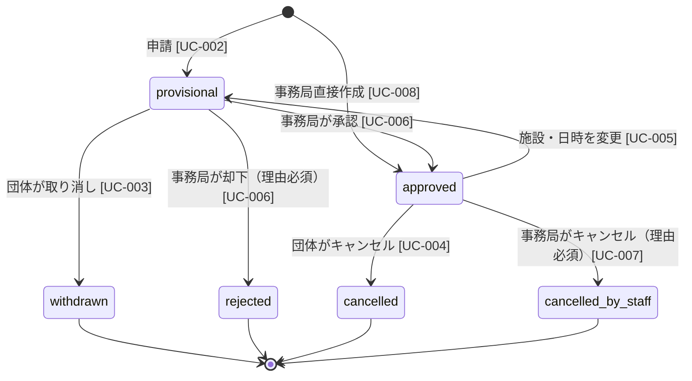

# ADR-003: 予約ステータスの6値設計 — 操作者（団体/事務局）をステータス値で区別する

- **ステータス**: Accepted
- **決定日**: 2026-03-18
- **決定者**: GDG on Campus Osaka 開発チーム
- **関連 RDRA**: INFO-001（status）, STATE-001, COND-002, UC-003, UC-004, UC-006, UC-007

---

## コンテキスト

予約には「取り消し」「却下」「キャンセル」という終了操作があり、それぞれ操作者（団体 / 事務局）と操作タイミング（承認前 / 承認後）が異なる。以下の点でシステムが操作者を区別できる必要がある。

- **通知先**: 団体操作→事務局へも通知、事務局操作→団体へ通知（通知先が異なる）
- **理由入力の必須/任意**: 事務局による操作（却下・キャンセル）は `status_reason` が必須、団体による操作は任意（COND-002）
- **Google Calendar 連携**: 承認後のキャンセル（団体・事務局どちらでも）は EVT-010（Calendar 削除）を発火する必要がある

## 選択肢

| 案 | ステータス設計 | 採否 |
|----|-------------|------|
| A: 3値 | `pending` / `approved` / `ended`（終了理由・操作者は別フィールドで管理） | ❌ |
| B: 4値 | `provisional` / `approved` / `cancelled` / `rejected` | ❌ |
| **C: 6値（採用）** | `provisional` / `approved` / `withdrawn` / `rejected` / `cancelled` / `cancelled_by_staff` | ✅ |

### 案A（3値）を却下した理由

`ended` に終了パターンをすべて集約すると、通知先・理由必須判定・Calendar 連携の要否をすべて別フィールドの組み合わせで判定しなければならない。アプリ側の条件分岐が複雑になり、誤実装のリスクが高い。

### 案B（4値）を却下した理由

- 「団体による承認前取り消し」と「団体による承認後キャンセル」が同じ `cancelled` に見え、承認前後の区別がステータスだけでは判断できない
- 「事務局による却下」と「事務局によるキャンセル」も同様に区別できない

## 決定

**予約ステータスを以下の6値で管理する。**

| ステータス値 | 操作者 | タイミング | status_reason |
|-------------|--------|-----------|---------------|
| `provisional` | — | 申請直後（承認待ち） | — |
| `approved` | 事務局 | 承認後（利用確定） | — |
| `withdrawn` | 団体 | 承認前に取り消し | 任意 |
| `rejected` | 事務局 | 承認前に却下 | **必須** |
| `cancelled` | 団体 | 承認後にキャンセル | 任意 |
| `cancelled_by_staff` | 事務局 | 承認後にキャンセル | **必須** |

### ステータス遷移

### ステータス値と STATE-001 の状態名の対応

`stateDiagram-v2` の各ノードは enum 値（`provisional` 等）で表記している。RDRA `state-models.md`（STATE-001）では日本語の状態名を使用しており、対応は以下の通り。

| enum 値（ADR・DB） | STATE-001 の状態名 |
|-------------------|------------------|
| `provisional` | 仮予約 |
| `approved` | 承認済み |
| `withdrawn` | 取り消し済み |
| `rejected` | 却下済み |
| `cancelled` | キャンセル済み |
| `cancelled_by_staff` | 事務局キャンセル済み |

## 影響・トレードオフ

| 項目 | 内容 |
|------|------|
| 実装のシンプルさ | ステータス値だけで操作者・タイミングを判断できるため、通知・Calendar 連携・理由必須チェックの条件分岐が明快になる |
| DB 設計 | `status` カラムの enum 値が6種になる。将来ステータスを追加する場合はマイグレーションが必要 |
| 終了状態の判定 | `withdrawn` / `rejected` / `cancelled` / `cancelled_by_staff` の4値が終了状態。施設無効化の前提条件（COND-003）もこの4値で判定する |
