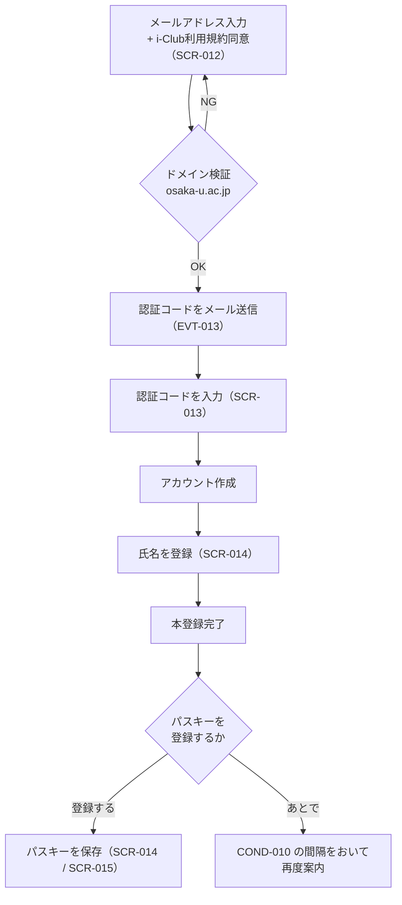
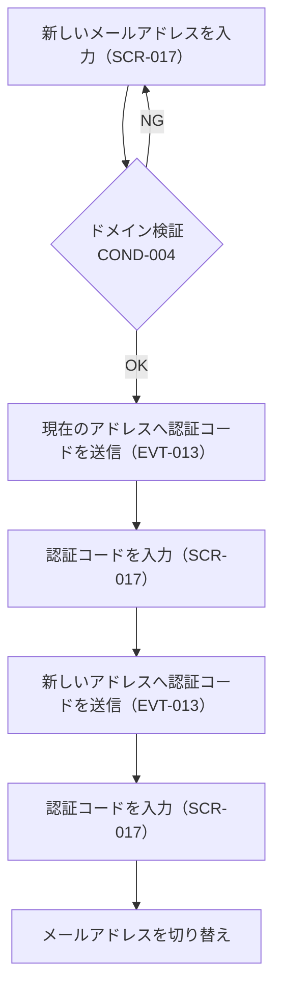
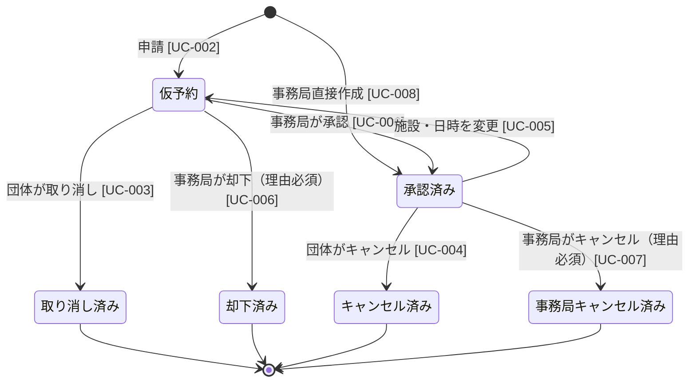
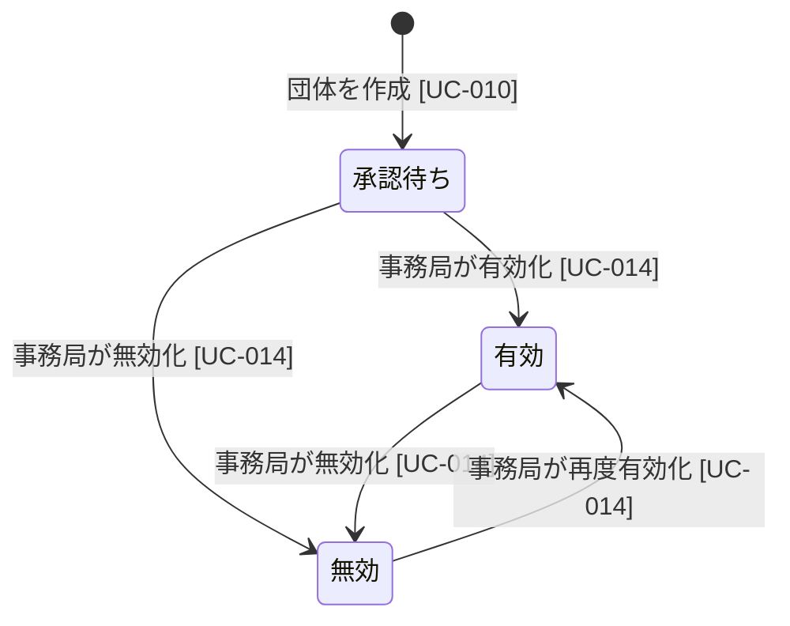
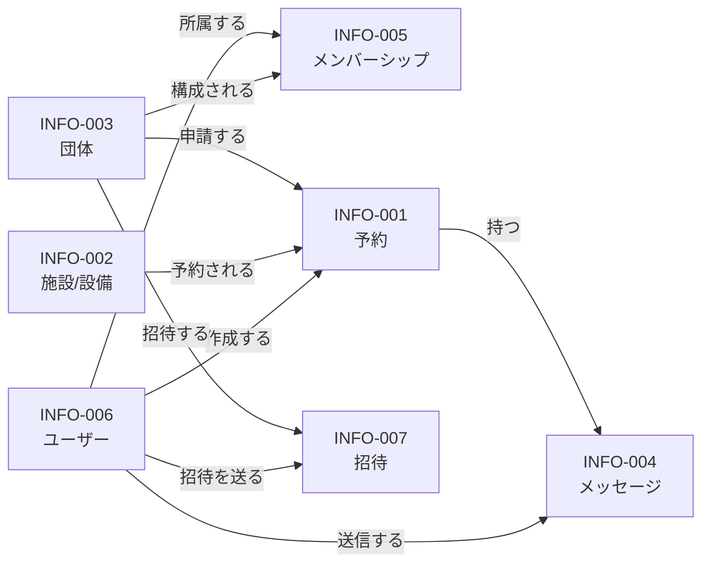

# iclub-reserve — 製品要件定義書（PRD）

> **ステータス**: Draft  
> **最終更新**: 2026-09-09  
> **準拠する RDRA 成果物**: [`change-log.md`](../change-log.md) の 2026-09-09 エントリ（第1回〜第3回）時点  
> **前回からの変更**: 実装との乖離を解消するため、認証方式・団体管理・予約の可視範囲を中心に改訂。  
> **実装状況**: 各要求がどこまで実装されているかは [`implementation-status.md`](implementation-status.md) を参照。

---

## 1. 背景と目的

Innovators' Club（i-Club）が管理する施設・設備の予約は、現状メールや口頭での申請が中心となっており、利用記録の管理や優先順位の制御が困難な状況にある。

**iclub-reserve** は、団体アカウントによる予約申請と事務局による承認フローを中心に据え、以下6つのゴールを達成するシステムである。

| ID       | ゴール                                                                              |
| -------- | ----------------------------------------------------------------------------------- |
| GOAL-001 | 団体アカウントで予約を管理し、誰がいつ利用したかを記録する                          |
| GOAL-002 | 承認制により施設利用の優先順位を事務局が制御できる                                  |
| GOAL-003 | 申請・承認の通知を自動化し、双方の手間を削減する                                    |
| GOAL-004 | 予約状況を Google Calendar に自動反映し、施設の利用状況を外部からも分かるようにする |
| GOAL-005 | 予約単位で事務局と団体がメッセージをやり取りでき、調整を一元化できる                |
| GOAL-006 | 阪大関係者（osaka-u.ac.jp ドメイン）のみに利用を限定する                            |

---

## 2. 利用者（アクター）

| ID        | アクター            | 説明                                                                                                        |
| --------- | ------------------- | ----------------------------------------------------------------------------------------------------------- |
| ACTOR-001 | **事務局**          | 予約の承認・却下・管理、団体・施設の管理を担う。所属に関わらず全団体・全予約を直接操作できる（COND-009）    |
| ACTOR-002 | **団体**            | 施設予約を申請する学内の学生団体（i-Squad含む）。osaka-u.ac.jp ドメインのメールを持つ学内ユーザーが構成する |
| ACTOR-003 | **Google Calendar** | 施設の利用状況を一般公開するカレンダー。外部システム                                                        |

---

## 3. 機能要件

### 3-1. ユーザー認証（BIZ-006）

ログインの手段はメール認証コードとパスキーの2つで、パスワードは扱わない。

| REQ     | 要求                                                                                                                                                               |
| ------- | ------------------------------------------------------------------------------------------------------------------------------------------------------------------ |
| REQ-008 | 登録できるメールアドレスは osaka-u.ac.jp ドメイン（サブドメイン含む）のみ。将来的に大学SSOとの連携を想定                                                           |
| REQ-031 | メールアドレスへ認証コードを送信し、コード入力によりログインする。未登録のメールアドレスの場合はその時点でアカウントを作成し、続けて氏名を登録して本登録を完了する |
| REQ-032 | 登録済みのユーザーは、メールアドレスへの認証コードまたはパスキーでログインできる。パスワードによるログインは提供しない                                             |
| REQ-033 | 初回アカウント登録時に i-Club 利用規約への同意が必要。同意しない場合は登録を完了できない                                                                           |
| REQ-034 | 認証コードでログインした利用者にパスキー（WebAuthn）の登録を勧め、登録後は認証コードを待たずにログインできる。パスキーは端末ごとに登録する                         |
| REQ-035 | 登録済みのメールアドレスを変更できる。変更には現在のアドレスと新しいアドレスの両方で認証コードによる確認を要する。新しいアドレスも COND-004 を満たすこと           |

**登録フロー**

**メールアドレス変更フロー**

現在のアドレスの確認を省かない。省くと、ログイン中の端末を一時的に奪われただけでアカウントごと乗っ取られてしまうためである。

**対象画面**: ログイン・新規登録画面（SCR-012）、認証コード入力画面（SCR-013）、初回セットアップ画面（SCR-014）、パスキー登録の案内画面（SCR-015）、メールアドレス変更画面（SCR-017）

---

### 3-2. 予約申請（BIZ-001）

団体ユーザーが施設・設備の空き確認、仮予約申請・取り消し・キャンセル・変更を行う。

| REQ     | 要求                                                                                                                                  |
| ------- | ------------------------------------------------------------------------------------------------------------------------------------- |
| REQ-001 | 施設・設備ごとの空き状況をカレンダー形式で確認できる。他団体の予約は団体名・施設・日時・ステータスのみを表示する（COND-008）          |
| REQ-002 | 施設/設備・日時（タイムラインUIで選択）・使用人数（必須）・備考を入力して仮予約を申請できる。申請できるのは有効な団体のみ（COND-006） |
| REQ-003 | 自団体の申請済み予約一覧を確認できる                                                                                                  |
| REQ-004 | 承認前の仮予約を自分で取り消せる                                                                                                      |
| REQ-005 | 申請結果（承認・却下）をメールで受け取れる                                                                                            |
| REQ-006 | 承認済み予約を事務局承認なしでキャンセルできる（事務局へ通知あり）                                                                    |
| REQ-007 | 承認済み予約の内容を変更できる。使用人数・備考の変更は通知のみ（再承認不要）。施設・日時の変更は仮予約に戻り再承認が必要              |
| REQ-009 | 予約単位で事務局・団体間のメッセージをやり取りできる（相互にメール通知あり）。メッセージは自団体のメンバーと事務局のみが閲覧できる    |
| REQ-029 | 承認前の仮予約の内容（施設/設備・日時・使用人数・備考）を直接編集できる。ステータス変更なし                                           |

**対象画面**: 空き状況カレンダー（SCR-001）、予約申請フォーム（SCR-002）、予約一覧・管理画面（SCR-003）、予約詳細・メッセージ画面（SCR-005）

---

### 3-3. 予約承認（BIZ-002）

事務局が仮予約の承認・却下、直接予約の作成・変更・削除、メッセージ送受信を行う。

| REQ     | 要求                                                                                   |
| ------- | -------------------------------------------------------------------------------------- |
| REQ-010 | 仮予約の一覧を確認できる                                                               |
| REQ-011 | 仮予約を承認・却下できる。却下時は理由の入力が必須。団体へ通知する                     |
| REQ-012 | 承認済み予約を事務局側からキャンセルできる。キャンセル理由の入力が必須。団体へ通知する |
| REQ-013 | 全団体の予約をカレンダー・一覧で確認できる                                             |
| REQ-014 | 事務局が直接予約を作成・変更・削除できる（承認フロー不要）                             |
| REQ-015 | 予約に紐づくメッセージを確認・送信できる                                               |

**対象画面**: SCR-001, SCR-002, SCR-003, SCR-005（BIZ-001 と共用）

---

### 3-4. 団体管理（BIZ-003）

| REQ     | 要求                                                                                                                                                           |
| ------- | -------------------------------------------------------------------------------------------------------------------------------------------------------------- |
| REQ-016 | 団体アカウントを新規作成できる。作成には事務局の承認を要さず、作成者が初期の管理者になる。ただし作成直後は承認待ちで、事務局が有効化するまで予約を申請できない |
| REQ-017 | 管理者または事務局がメールアドレスへ招待を送り、招待された人が承諾することでメンバーになる。招待は取り消せる                                                   |
| REQ-018 | 管理者または事務局がメンバーを管理者に昇格・降格できる                                                                                                         |
| REQ-019 | 管理者または事務局がメンバーを削除できる                                                                                                                       |
| REQ-020 | 管理者または事務局が団体情報（名称等）を編集できる                                                                                                             |
| REQ-021 | 事務局が団体を有効化・無効化できる。団体は削除せず、無効化で運用する                                                                                           |

**ロール**: `admin`（管理者）/ `member`（メンバー）。管理者はメンバー管理・団体情報編集が可能。メンバーは予約申請・閲覧のみ。1人が持てる役割は1つだけ（COND-007）。

**団体の状態**: `pending`（承認待ち）→ `enabled`（有効）⇄ `disabled`（無効）。予約を申請できるのは `enabled` のみ（COND-006）。

**存在の秘匿**: 所属していない団体については、存在するかどうかを判別できる情報を返さない（COND-011）。団体の登録の有無は、その団体が活動しているかどうかを外部に示す情報になりうるためである。

秘匿の対象は、識別子や表示名で団体を指定して引く経路（詳細取得・検索・一覧）に限る。他団体の予約に団体名を表示することは COND-008 が定めた仕様であり、この条件とは矛盾しない。「予約が入っている団体があることは分かる」ことと「団体を名指しで引ける」ことを別に扱っている。招待を受け取った人も、承諾を判断するために招待が有効な間は招待元の団体名を確認できる（SCR-016）。

**対象画面**: 団体作成フォーム（SCR-006）、団体管理画面（SCR-007）、団体一覧画面（SCR-008）、招待の承諾画面（SCR-016）

---

### 3-5. 施設管理（BIZ-004）

| REQ     | 要求                                                                                                                                         |
| ------- | -------------------------------------------------------------------------------------------------------------------------------------------- |
| REQ-022 | 施設・設備を新規登録できる（名称・写真・説明・有効/無効・Google Calendar ID）                                                                |
| REQ-023 | 施設・設備の情報を編集できる                                                                                                                 |
| REQ-024 | 施設・設備を無効化できる。無効化前に将来の予約（仮予約・承認済み）がすべて終了状態（取り消し済み・却下済み・キャンセル済み）であることが必要 |
| REQ-025 | 施設・設備の一覧を確認できる                                                                                                                 |

**対象画面**: 施設管理画面（SCR-009）

**初期施設・設備**

| 名称                           | 種別 |
| ------------------------------ | ---- |
| 吹田：C棟2階占有 イベント予約  | 部屋 |
| 吹田：3Dプリンター 積層タイプ  | 設備 |
| 吹田：3Dプリンター 積層タイプ2 | 設備 |
| 吹田：3Dプリンター 光造形機    | 設備 |
| 吹田：レーザーカッター         | 設備 |
| 吹田：CAD用パソコン            | 設備 |
| 豊中試作室                     | 部屋 |
| 豊中試作室：3Dプリンター       | 設備 |

> 種別は INFO-002 の属性として持たず、施設名称に含める運用とする。

---

### 3-6. カレンダー連携（BIZ-005）

| REQ     | 要求                                                                                                                                                                 |
| ------- | -------------------------------------------------------------------------------------------------------------------------------------------------------------------- |
| REQ-026 | 施設・設備ごとに専用の Google Calendar を作成し公開する（Google Service Account 使用）。承認済み予約を自動登録する。公開情報は施設名・日時のみとし、団体名は載せない |
| REQ-027 | 承認済み予約がキャンセルされた際に Google Calendar から自動削除する                                                                                                  |
| REQ-028 | 承認済み予約の公開フィールド（施設名・日時）が変更された際に Google Calendar を自動更新する                                                                          |
| REQ-030 | 施設・設備ごとのカレンダー購読URL（iCal 形式）をログイン済みの団体・事務局に公開する。URLを入手した後はそのURLを使って誰でもカレンダーに追加できる                   |

**Calendar イベントトリガー**

| イベント        | トリガー                                                                                                           |
| --------------- | ------------------------------------------------------------------------------------------------------------------ |
| 登録（EVT-009） | 承認時（UC-006）/ 事務局直接作成時（UC-008）                                                                       |
| 削除（EVT-010） | 団体キャンセル（UC-004）/ 事務局キャンセル（UC-007）/ 施設・日時変更で差し戻し（UC-005）/ 事務局直接削除（UC-008） |
| 更新（EVT-011） | 事務局が承認済み予約の公開フィールドを直接変更（UC-008）                                                           |

**対象画面**: カレンダー一覧・購読ページ（SCR-010）

---

## 4. 業務ルール・制約

| ID       | ルール                                                                                                                                                                                                                                                                                        |
| -------- | --------------------------------------------------------------------------------------------------------------------------------------------------------------------------------------------------------------------------------------------------------------------------------------------- |
| COND-001 | **重複予約不可**: 同一施設・同一時間帯に承認済みの予約が存在しないこと。申請時・変更時・承認時・事務局直接作成時に確認する。重複が存在する場合は先にキャンセルが必要                                                                                                                          |
| COND-002 | **却下・キャンセル必須入力**: 事務局による却下（`rejected`）および事務局キャンセル（`cancelled_by_staff`）時は理由の入力が必須。団体による取り消し・キャンセルは任意                                                                                                                          |
| COND-003 | **施設無効化の前提条件**: 無効化対象施設の将来の予約（仮予約・承認済み）がすべて終了状態（取り消し済み・却下済み・キャンセル済み）であること。現在使用中の予約は対象外                                                                                                                        |
| COND-004 | **メールドメイン検証**: アカウント作成時とメールアドレス変更時は、対象アドレスのドメインが osaka-u.ac.jp またはそのサブドメインであること。ログインはこの制限を受けず、既にアカウントを持つ人はドメインを問わずログインできる。このログイン向けの例外をメールアドレス変更に流用してはならない |
| COND-005 | **承認済み予約の変更種別による再承認要否**: 施設または日時の変更は仮予約に差し戻し再承認が必要。使用人数・備考のみの変更は再承認不要で通知のみ                                                                                                                                                |
| COND-006 | **承認待ち団体の利用制限**: 団体の状態が `pending` または `disabled` の間は予約を申請できない。申請できるのは `enabled` の団体のみ。既存の予約の閲覧は状態を問わず可能                                                                                                                        |
| COND-007 | **メンバーロールの単一性**: 1つのメンバーシップが持つ役割は常に1つだけ。複数の役割を同時に指定する要求、および定義外の役割を指定する要求は処理前に拒否する                                                                                                                                    |
| COND-008 | **予約の可視範囲**: 予約の情報は3段階で開示する（下表）                                                                                                                                                                                                                                       |
| COND-009 | **事務局の横断権限**: 事務局（`is_staff` が true）は団体への所属に関わらず、全団体・全施設・全予約を操作できる。団体内ロールとは別の軸の権限                                                                                                                                                  |
| COND-010 | **パスキー登録案内の再表示間隔**: 見送られた場合、1回目のあとは14日、2回目のあとは60日をあけて再度案内する。3回目以降は案内しない。記録は端末ごとに持つ                                                                                                                                       |
| COND-011 | **団体情報の存在秘匿**: 所属していない団体については、存在するかどうかを判別できる情報を返さない。「存在しない」場合と「存在するが未所属」の場合で同じ応答を返す。事務局は対象外                                                                                                              |

### COND-008: 予約の可視範囲

| 属性                 | 自団体・事務局 | 他団体（ログイン済み） | 一般（Google Calendar） |
| -------------------- | :------------: | :--------------------: | :---------------------: |
| 施設名               |       ○        |           ○            |            ○            |
| 日時（開始・終了）   |       ○        |           ○            |            ○            |
| 団体名               |       ○        |           ○            |            ×            |
| ステータス           |       ○        |           ○            |            ×            |
| 使用人数             |       ○        |           ×            |            ×            |
| 備考                 |       ○        |           ×            |            ×            |
| 却下・キャンセル理由 |       ○        |           ×            |            ×            |
| 作成者               |       ○        |           ×            |            ×            |
| メッセージ           |       ○        |           ×            |            ×            |

Google Calendar に載せるのは承認済みの予約のみ。ログイン済みの他団体ユーザーには、仮予約もステータス付きで表示する。

---

## 5. 通知（メール）設計

| イベント                        | 通知先                                                   |
| ------------------------------- | -------------------------------------------------------- |
| 仮予約申請（EVT-001）           | 申請者・団体管理者全員・事務局                           |
| 取り消し完了（EVT-002）         | 申請者・団体管理者全員                                   |
| 団体キャンセル（EVT-003）       | 申請者・団体管理者全員・事務局                           |
| 承認済み予約変更（EVT-004）     | 申請者・団体管理者全員・事務局                           |
| 承認通知（EVT-005）             | 申請者・団体管理者全員                                   |
| 却下通知（EVT-006）             | 申請者・団体管理者全員（却下理由を含む）                 |
| 事務局キャンセル通知（EVT-007） | 申請者・団体管理者全員（キャンセル理由を含む）           |
| メッセージ通知（EVT-008）       | 団体→事務局へ通知 / 事務局→申請者・団体管理者全員へ通知  |
| 仮予約変更通知（EVT-012）       | 申請者・団体管理者全員・事務局                           |
| 認証コード送信（EVT-013）       | 入力されたメールアドレス                                 |
| 招待通知（EVT-014）             | 招待先のメールアドレス（団体名・役割・承諾リンク・期限） |

---

## 6. 状態遷移

### 6-1. 予約ステータス（STATE-001）

予約エントリは以下6つのステータスを持つ。

| ステータス値         | 説明                                           |
| -------------------- | ---------------------------------------------- |
| `provisional`        | 事務局の承認待ち（仮予約）                     |
| `approved`           | 施設利用が確定した状態                         |
| `withdrawn`          | 承認前に団体自身が取り消した状態               |
| `rejected`           | 承認前に事務局が却下した状態（理由必須）       |
| `cancelled`          | 承認後に団体がキャンセルした状態               |
| `cancelled_by_staff` | 承認後に事務局がキャンセルした状態（理由必須） |

### 6-2. 団体ステータス（STATE-002）

| ステータス値 | 説明                                                   |
| ------------ | ------------------------------------------------------ |
| `pending`    | 作成直後。事務局の有効化待ちで、予約を申請できない     |
| `enabled`    | 事務局が有効化した状態。予約を申請できる               |
| `disabled`   | 無効化した状態。予約を申請できないが、記録と閲覧は残る |

団体を削除する遷移は用意しない。予約が紐づく団体を消すと、過去に誰がいつ利用したかをたどれなくなるため（GOAL-001）。

---

## 7. データモデル概要

**主要エンティティ**

| エンティティ            | 主要属性                                                                                        |
| ----------------------- | ----------------------------------------------------------------------------------------------- |
| INFO-001 予約           | id, group_id, facility_id, start_at, end_at, headcount, note, status, status_reason, created_by |
| INFO-002 施設/設備      | id, name, description, photo_url, google_calendar_id, calendar_url, is_active                   |
| INFO-003 団体           | id, name, slug, status（pending/enabled/disabled）, logo, metadata                              |
| INFO-004 メッセージ     | id, reservation_id, sender_id, body, sent_at                                                    |
| INFO-005 メンバーシップ | id, user_id, group_id, role（admin/member）                                                     |
| INFO-006 ユーザー       | id, email, name, email_verified, image, is_staff                                                |
| INFO-007 招待           | id, group_id, email, role, status（pending/accepted/rejected/canceled）, expires_at, inviter_id |

> 認証基盤（Better Auth）が内部で管理するテーブル——セッション・外部アカウント・認証コード・パスキー——は業務上の情報ではないため、情報モデルには含めない。

---

## 8. 画面一覧

| ID      | 画面名                     | 主な利用者                                       |
| ------- | -------------------------- | ------------------------------------------------ |
| SCR-001 | 空き状況カレンダー画面     | 全ユーザー（事務局は管理操作追加表示）           |
| SCR-002 | 予約申請フォーム           | 団体                                             |
| SCR-003 | 予約一覧・管理画面         | 団体（自団体のみ）/ 事務局（全団体）             |
| SCR-005 | 予約詳細・メッセージ画面   | 団体・事務局                                     |
| SCR-006 | 団体作成フォーム           | 団体                                             |
| SCR-007 | 団体管理画面               | 管理者・事務局のみ                               |
| SCR-008 | 団体一覧画面               | 団体（自団体のみ）/ 事務局（全団体・有効化操作） |
| SCR-009 | 施設管理画面               | 事務局のみ                                       |
| SCR-010 | カレンダー一覧・購読ページ | ログイン済み団体・事務局                         |
| SCR-012 | ログイン・新規登録画面     | 全ユーザー                                       |
| SCR-013 | 認証コード入力画面         | 全ユーザー（SCR-012 内のステップ）               |
| SCR-014 | 初回セットアップ画面       | アカウント作成直後のユーザー                     |
| SCR-015 | パスキー登録の案内画面     | 認証コードでログインしたユーザー                 |
| SCR-016 | 招待の承諾画面             | 招待を受けたユーザー                             |
| SCR-017 | メールアドレス変更画面     | 全ユーザー                                       |

> SCR-011（アカウント登録フォーム）は廃止。認証コード方式では登録とログインの処理が同一のため、SCR-012 に統合した。

---

## 9. スコープ外（MVP除外）

- パスワードによるログイン（認証コードとパスキーで代替。将来のSSO連携を見据えて採用しない）
- パスワードリセット機能（パスワードを持たないため不要）
- 大学認証システム（SSO）との連携（将来対応）
- 予約承認フローの段階的承認（多段階承認は対象外）
- 施設の空き状況を一般公開（Google Calendar経由での公開のみ）

---

## 10. トレーサビリティ

本 PRD の全要求は RDRA 成果物（`rdra/` ディレクトリ）にトレースされる。

- 全ゴール: 6件（GOAL-001〜006）
- 全要求: 35件（REQ-001〜035）
- ビジネスユースケース: 24件（BUC-001〜024）
- システムユースケース: 23件（UC-001〜023）

詳細なトレーサビリティは [`rdra/traceability.yaml`](../rdra/traceability.yaml) を参照。
