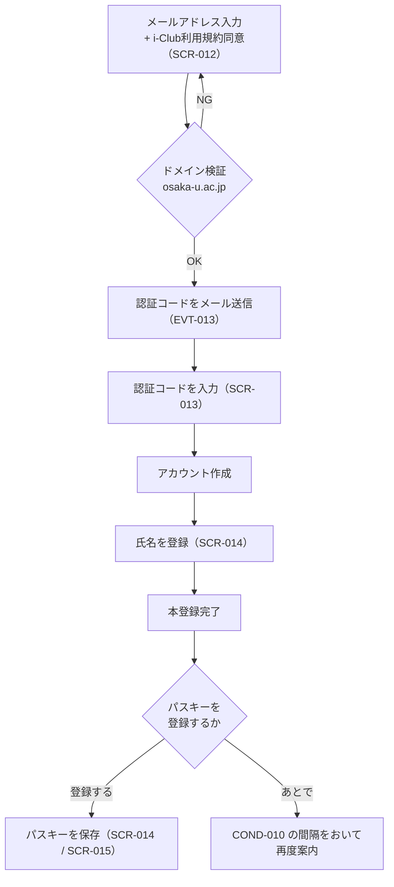
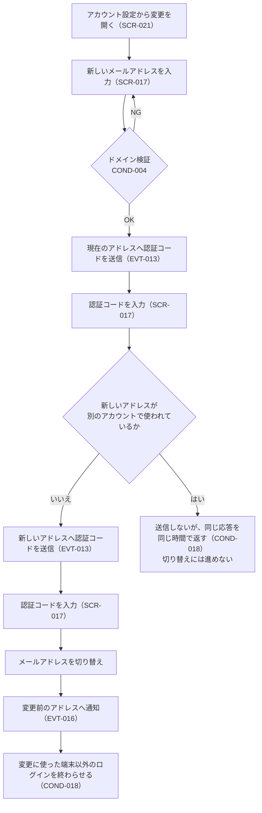
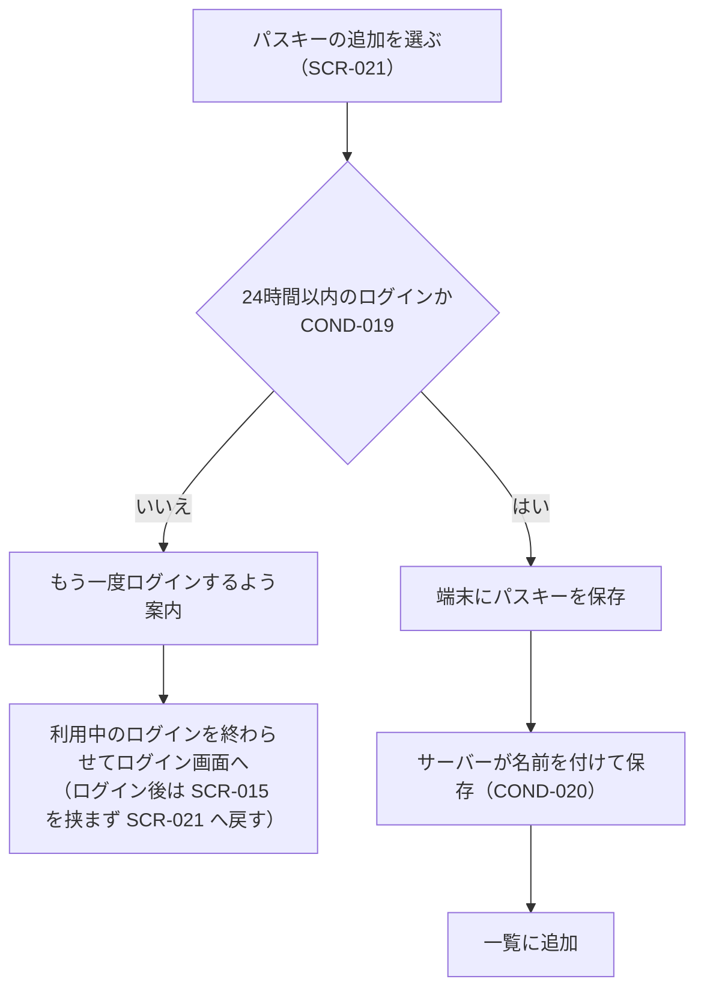
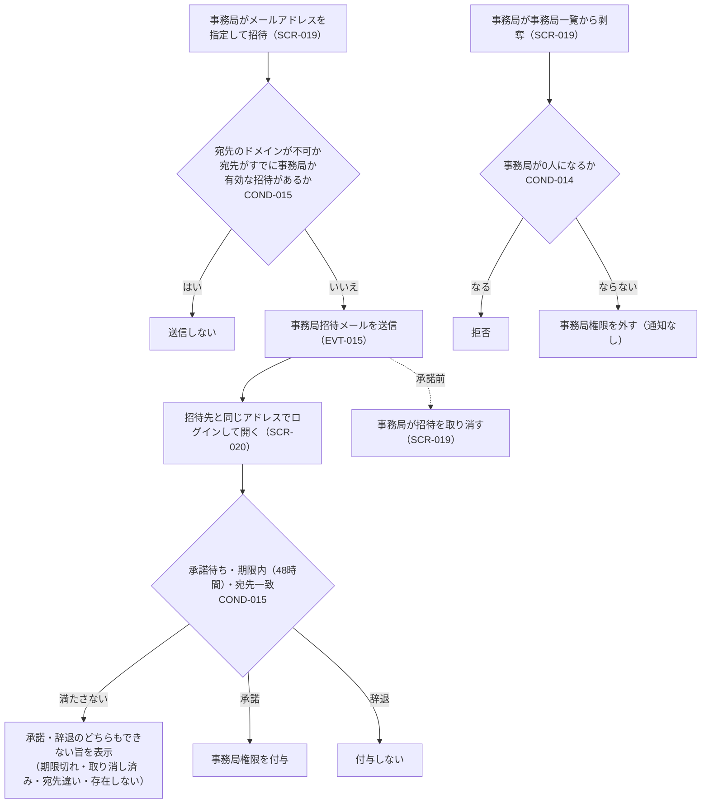
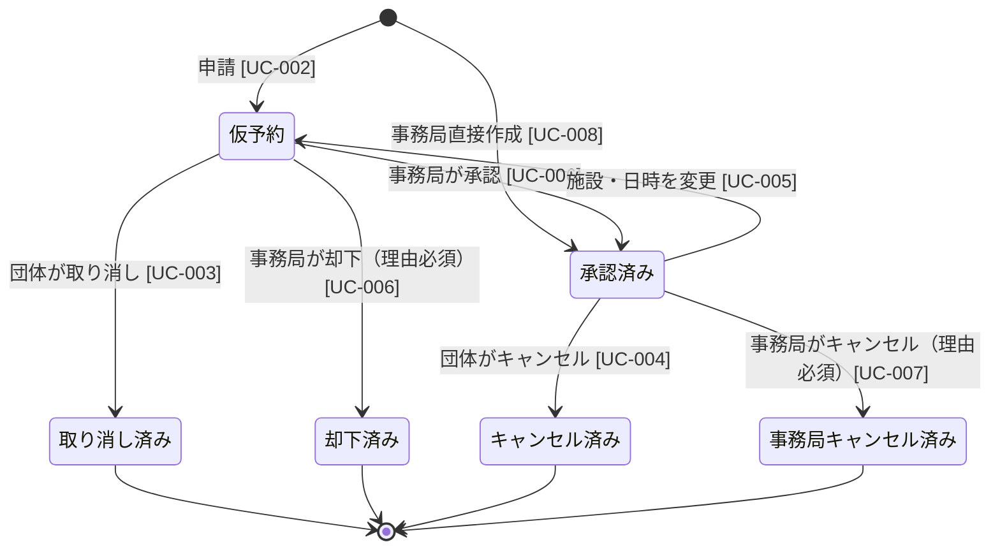
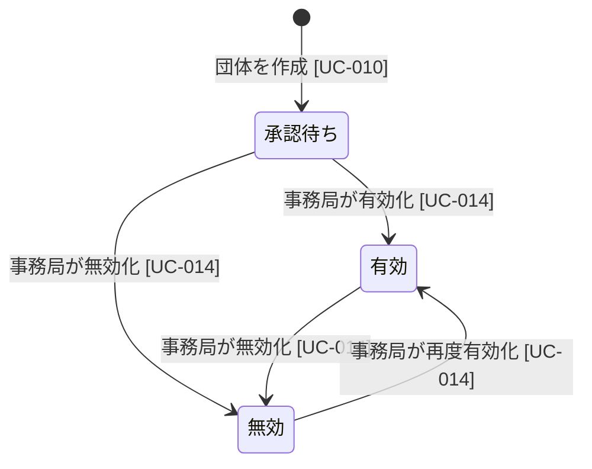
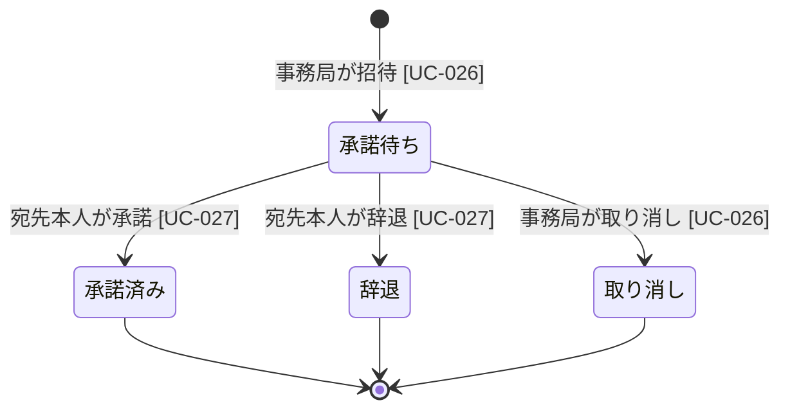
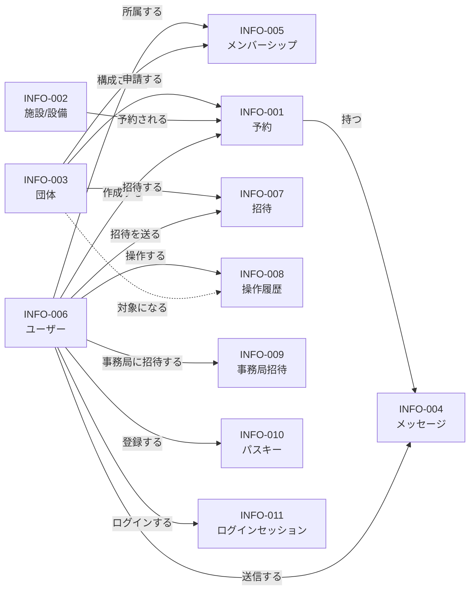

# iclub-reserve — 製品要件定義書（PRD）

> **ステータス**: Draft  
> **最終更新**: 2026-09-24  
> **準拠する RDRA 成果物**: [`change-log.md`](../change-log.md) の 2026-09-24 エントリ時点  
> **前回からの変更**: パスキーの一覧に提供元のアイコンを出し、提供元の対応表をコミュニティの一覧の写しに改めた（REQ-043・COND-020）。  
> **実装状況**: 各要求がどこまで実装されているかは [`implementation-status.md`](implementation-status.md) を参照。

---

## 1. 背景と目的

Innovators' Club（i-Club）が管理する施設・設備の予約は、現状メールや口頭での申請が中心となっており、利用記録の管理や優先順位の制御が困難な状況にある。

**iclub-reserve** は、団体アカウントによる予約申請と事務局による承認フローを中心に据え、以下7つのゴールを達成するシステムである。

| ID       | ゴール                                                                                                                   |
| -------- | ------------------------------------------------------------------------------------------------------------------------ |
| GOAL-001 | 団体アカウントで予約を管理し、誰がいつ利用したかを記録する                                                               |
| GOAL-002 | 承認制により施設利用の優先順位を事務局が制御できる                                                                       |
| GOAL-003 | 申請・承認の通知を自動化し、双方の手間を削減する                                                                         |
| GOAL-004 | 予約状況を Google Calendar に自動反映し、施設の利用状況を外部からも分かるようにする                                      |
| GOAL-005 | 予約単位で事務局と団体がメッセージをやり取りでき、調整を一元化できる                                                     |
| GOAL-006 | 阪大関係者（osaka-u.ac.jp ドメイン）のみに利用を限定する                                                                 |
| GOAL-007 | 予約・団体（メンバー・招待を含む）・施設・事務局権限への操作について、誰が・いつ・何を・どう変えたかを後から確かめられる |

---

## 2. 利用者（アクター）

| ID        | アクター            | 説明                                                                                                                                                     |
| --------- | ------------------- | -------------------------------------------------------------------------------------------------------------------------------------------------------- |
| ACTOR-001 | **事務局**          | 予約の承認・却下・管理、団体・施設の管理を担う。所属に関わらず全団体・全予約を直接操作できる（COND-009）。事務局権限の付与・剥奪と、操作履歴の確認も担う |
| ACTOR-002 | **団体**            | 施設予約を申請する学内の学生団体（i-Squad含む）。osaka-u.ac.jp ドメインのメールを持つ学内ユーザーが構成する                                              |
| ACTOR-003 | **Google Calendar** | 施設の利用状況を一般公開するカレンダー。外部システム                                                                                                     |

---

## 3. 機能要件

### 3-1. ユーザー認証・権限（BIZ-006）

ログインの手段はメール認証コードとパスキーの2つで、パスワードは扱わない。

| REQ     | 要求                                                                                                                                                                                                                                                                                                                       |
| ------- | -------------------------------------------------------------------------------------------------------------------------------------------------------------------------------------------------------------------------------------------------------------------------------------------------------------------------- |
| REQ-008 | 登録できるメールアドレスは osaka-u.ac.jp ドメイン（サブドメイン含む）のみ。将来的に大学SSOとの連携を想定                                                                                                                                                                                                                   |
| REQ-031 | メールアドレスへ認証コードを送信し、コード入力によりログインする。未登録のメールアドレスの場合はその時点でアカウントを作成し、続けて氏名を登録して本登録を完了する                                                                                                                                                         |
| REQ-032 | 登録済みのユーザーは、メールアドレスへの認証コードまたはパスキーでログインできる。パスワードによるログインは提供しない。利用を終えるときはログアウトできる                                                                                                                                                                 |
| REQ-033 | 初回アカウント登録時に i-Club 利用規約への同意が必要。同意しない場合は登録を完了できない                                                                                                                                                                                                                                   |
| REQ-034 | 認証コードでログインした利用者にパスキー（WebAuthn）の登録を勧め、登録後は認証コードを待たずにログインできる。パスキーは端末ごとに登録する                                                                                                                                                                                 |
| REQ-035 | 登録済みのメールアドレスを変更できる。変更には現在のアドレスと新しいアドレスの両方で認証コードによる確認を要する。新しいアドレスも COND-004 を満たすこと。新しいアドレスが別のアカウントで使われているかどうかは明かさない。変更が済んだら変更前のアドレスへ知らせ、変更に使った端末以外のログインを終わらせる（COND-018） |
| REQ-041 | 事務局が事務局権限を付与・剥奪できる。付与はメールアドレスへの招待と承諾で行い、剥奪は通知なしで即時に行う。事務局が0人になる剥奪はできない（他に事務局がいれば自分自身の剥奪は可）。付与・剥奪は操作履歴に記録する                                                                                                        |
| REQ-042 | 登録済みの氏名を変更できる。氏名は本名とし、COND-017 の入力規則を満たすこと。変更は操作履歴に記録しない                                                                                                                                                                                                                    |
| REQ-043 | 登録済みのパスキーを一覧で確かめ、追加・名前の変更・削除ができる。一覧には提供元のアイコン・名前・登録日時・最後に使った日時・同期されるかどうかを表示する。追加には直近のログインを要する（COND-019）。最後の1つも削除でき、その後は認証コードでログインする                                                              |
| REQ-044 | ログイン中の端末を一覧で確かめ、利用中の端末以外をログアウトさせられる。1台ずつのログアウトと、利用中の端末以外すべてのログアウトの両方を行える                                                                                                                                                                            |

**登録フロー**

**メールアドレス変更フロー**

現在のアドレスの確認を省かない。省くと、ログイン中の端末を一時的に奪われただけでアカウントごと乗っ取られてしまうためである。新しいアドレスが使用済みかどうかを明かさないのは、学内の誰がアカウントを持っているかを調べる手段にさせないためである。応答の中身だけでなく応答までの時間もそろえる（メールの送信を待たずに応答する）。コードを待つ画面では、届かない場合はそのアドレスが既に使われている可能性があることを案内する。

端末やパスワードマネージャーに保存されたパスキーの表示名は、変更前のアドレスのまま残る。Better Auth が登録時のユーザー識別子を保存しないため、端末へ新しいアドレスを伝えられない（ログインには影響しない）。

**アカウント設定（SCR-021）**

ログイン中の利用者が自分のアカウントを管理する画面（`/account`）。PC ではサイドバー下部のアカウントメニューから、スマートフォンではボトムバーの「その他」から開く。次の4つの欄を1ページに並べる。事務局と団体のユーザーで内容は変わらない。

| 欄               | できること                                                                  | 表示する項目                                                                       | UC             |
| ---------------- | --------------------------------------------------------------------------- | ---------------------------------------------------------------------------------- | -------------- |
| 氏名             | その場で編集して保存（COND-017）                                            | 氏名                                                                               | UC-029         |
| メールアドレス   | 変更（SCR-017 のダイアログ）                                                | 現在のメールアドレス                                                               | UC-023         |
| パスキー         | 追加（COND-019）・名前の変更・削除（確認あり。最後の1つも可）               | 提供元のアイコン・名前（COND-020）・登録日時・最後に使った日時・同期されるかどうか | UC-021・UC-030 |
| ログイン中の端末 | 1台ずつのログアウト・利用中の端末以外すべてのログアウト（どちらも確認あり） | 端末名（COND-020）・ログインした日時・最後に使った日・利用中の印                   | UC-031         |

- 氏名は、事務局が「誰がいつ利用したか」（GOAL-001）を確かめられるよう本名を求める。変更すると、画面に出る氏名（団体のメンバー一覧・予約の申請者・操作履歴の操作者。過去の操作履歴も含む）がすべて新しい氏名になる。通知メールの宛名は、変更後に作られる通知から新しい氏名になる。
- 氏名の変更は記録しないため、ある時点でその人が何と名乗っていたかは分からなくなる。「誰が利用したか」は利用者 ID で一貫してたどれるので、このリスクは受け入れる。
- パスキーの「同期されるかどうか」は登録した時点の値で、「同期される」「同期されない（登録した認証器だけ）」と表示する。
- パスキーを削除しても、端末やパスワードマネージャーに保存されたパスキーは残る。確認の際にそちらでも削除するよう案内し、対応しているブラウザでは WebAuthn の Signal API で端末にも削除を伝える。
- パスキーに対応していないブラウザには、追加の操作の代わりに対応していない旨を表示する。
- ログイン中の端末の「最後に使った日」は、セッションの延長が1日に1回までであるため日単位の目安になる。セッションのトークンは画面にも利用者のブラウザにも渡さない。
- アカウント設定の操作はいずれも操作履歴に記録しない（GOAL-007 の対象外）。

**パスキー追加フロー（アカウント設定から）**

**事務局権限の付与・剥奪フロー**

以前は `is_staff` を DB で直接書き換えるしかなく、誰がいつ権限を与えたかが残らなかった。付与・剥奪を画面から行えるようにし、操作履歴（3-7）に記録する。最初の1人の事務局だけは DB またはシードで設定する。付与の通知は招待メールが兼ね、剥奪は通知しない。

**対象画面**: ログイン・新規登録画面（SCR-012）、認証コード入力画面（SCR-013）、初回セットアップ画面（SCR-014）、パスキー登録の案内画面（SCR-015）、メールアドレス変更画面（SCR-017）、事務局管理画面（SCR-019）、事務局招待の承諾画面（SCR-020）、アカウント設定画面（SCR-021）

---

### 3-2. 予約申請（BIZ-001）

団体ユーザーが施設・設備の空き確認、仮予約申請・取り消し・キャンセル・変更、自団体の予約の一覧と予約の詳細の確認を行う。

| REQ     | 要求                                                                                                                                                                                                                        |
| ------- | --------------------------------------------------------------------------------------------------------------------------------------------------------------------------------------------------------------------------- |
| REQ-001 | 施設・設備ごとの空き状況をカレンダー形式で確認できる。他団体の予約は団体名・施設・日時・ステータスのみを表示する（COND-008）                                                                                                |
| REQ-002 | 申請元の団体・施設/設備・日時（タイムラインUIで選択）・使用人数（必須）・備考を入力して仮予約を申請できる。申請元にできるのは、自分が所属する団体（事務局は所属に関わらず全団体。COND-009）のうち有効な団体のみ（COND-006） |
| REQ-003 | 自団体の申請済み予約一覧を確認できる                                                                                                                                                                                        |
| REQ-004 | 承認前の仮予約を自分で取り消せる                                                                                                                                                                                            |
| REQ-005 | 申請結果（承認・却下）をメールで受け取れる                                                                                                                                                                                  |
| REQ-006 | 承認済み予約を事務局承認なしでキャンセルできる（事務局へ通知あり）                                                                                                                                                          |
| REQ-007 | 承認済み予約の内容を変更できる。使用人数・備考の変更は通知のみ（再承認不要）。施設・日時の変更は仮予約に戻り再承認が必要                                                                                                    |
| REQ-009 | 予約単位で事務局・団体間のメッセージをやり取りできる（相互にメール通知あり）。メッセージは自団体のメンバーと事務局のみが閲覧できる                                                                                          |
| REQ-029 | 承認前の仮予約の内容（施設/設備・日時・使用人数・備考）を直接編集できる。ステータス変更なし                                                                                                                                 |

**対象画面**: 空き状況カレンダー（SCR-001）、予約申請フォーム（SCR-002）、予約一覧・管理画面（SCR-003）、予約詳細・メッセージ画面（SCR-005）

---

### 3-3. 予約承認（BIZ-002）

事務局が全団体の予約の一覧確認、仮予約の承認・却下、直接予約の作成・変更、メッセージ送受信を行う。

| REQ     | 要求                                                                                                                                                   |
| ------- | ------------------------------------------------------------------------------------------------------------------------------------------------------ |
| REQ-010 | 仮予約の一覧を確認できる                                                                                                                               |
| REQ-011 | 仮予約を承認・却下できる。却下時は理由の入力が必須。団体へ通知する                                                                                     |
| REQ-012 | 承認済み予約を事務局側からキャンセルできる。キャンセル理由の入力が必須。団体へ通知する                                                                 |
| REQ-013 | 全団体の予約をカレンダー・一覧で確認できる                                                                                                             |
| REQ-014 | 事務局が直接予約を作成・変更できる（承認フロー不要）。予約の削除は行わず、取りやめる場合は事務局キャンセル（REQ-012）または却下（REQ-011）で理由を残す |
| REQ-015 | 予約に紐づくメッセージを確認・送信できる                                                                                                               |

事務局は予約を削除できない。削除すると予約詳細ごと消え、団体が「いつ・なぜ無くなったか」を確かめられなくなるためである（GOAL-007）。

**対象画面**: SCR-001, SCR-002, SCR-003, SCR-005（BIZ-001 と共用）

---

### 3-4. 団体管理（BIZ-003）

| REQ     | 要求                                                                                                                                                                                                   |
| ------- | ------------------------------------------------------------------------------------------------------------------------------------------------------------------------------------------------------ |
| REQ-016 | 団体アカウントを新規作成できる。作成には事務局の承認を要さず、作成者が初期の管理者になる。ただし作成直後は承認待ちで、事務局が有効化するまで予約を申請できない                                         |
| REQ-017 | 管理者または事務局がメールアドレスへ招待を送り、招待された人が承諾することでメンバーになる。招待は取り消せる                                                                                           |
| REQ-018 | 管理者または事務局がメンバーを管理者に昇格・降格できる                                                                                                                                                 |
| REQ-019 | 管理者または事務局がメンバーを削除できる                                                                                                                                                               |
| REQ-020 | 管理者または事務局が団体情報（名称等）を編集できる                                                                                                                                                     |
| REQ-021 | 事務局が団体を有効化・無効化できる。団体は削除せず、無効化で運用する                                                                                                                                   |
| REQ-045 | 自分が所属する団体の一覧を、状態（承認待ち・有効・無効）とともに確認できる。所属する団体の団体情報とメンバーの一覧も確認できる。メンバーのメールアドレスと承諾待ちの招待は、管理者と事務局にだけ見せる |

**ロール**: `admin`（管理者）/ `member`（メンバー）。メンバーは自団体の予約の申請・取り消し・キャンセルと、予約・団体・メンバーの閲覧ができる（メンバーのメールアドレスと承諾待ちの招待は見られない）。管理者はそれに加えてメンバー管理・団体情報編集ができる。1人が持てる役割は1つだけ（COND-007）。

**団体の状態**: `pending`（承認待ち）→ `enabled`（有効）⇄ `disabled`（無効）。予約を申請できるのは `enabled` のみ（COND-006）。

**存在の秘匿**: 所属していない団体については、存在するかどうかを判別できる情報を返さない（COND-011）。団体の登録の有無は、その団体が活動しているかどうかを外部に示す情報になりうるためである。

秘匿の対象は、識別子や表示名で団体を指定して引く経路（詳細取得・検索・一覧）に限る。他団体の予約に団体名を表示することは COND-008 が定めた仕様であり、この条件とは矛盾しない。「予約が入っている団体があることは分かる」ことと「団体を名指しで引ける」ことを別に扱っている。招待を受け取った人も、承諾を判断するために招待が有効な間は招待元の団体名を確認できる（SCR-016）。

**対象画面**: 団体作成フォーム（SCR-006）、団体管理画面（SCR-007）、団体一覧画面（SCR-008）、招待の承諾画面（SCR-016）、ダッシュボード（SCR-022）

---

### 3-5. 施設管理（BIZ-004）

| REQ     | 要求                                                                                                                                                                                                                                                                         |
| ------- | ---------------------------------------------------------------------------------------------------------------------------------------------------------------------------------------------------------------------------------------------------------------------------- |
| REQ-022 | 施設・設備を新規登録できる（名称・写真・説明・有効/無効・Google Calendar ID）                                                                                                                                                                                                |
| REQ-023 | 施設・設備の情報を編集できる                                                                                                                                                                                                                                                 |
| REQ-024 | 施設・設備を無効化できる。無効化前に将来の予約（仮予約・承認済み）がすべて終了状態（取り消し済み・却下済み・キャンセル済み）であることが必要。現在使用中の承認済み予約は除外されるが、終了前の仮予約が残っている場合は無効化できない。無効にした施設・設備は再び有効にできる |
| REQ-025 | 施設・設備の一覧を確認できる                                                                                                                                                                                                                                                 |

**対象画面**: 施設管理画面（SCR-009）

**初期施設・設備**

| 名称                           | 種別 |
| ------------------------------ | ---- |
| 吹田：C棟2階占有 イベント予約  | 部屋 |
| 吹田：3Dプリンター 積層タイプ  | 設備 |
| 吹田：3Dプリンター 積層タイプ2 | 設備 |
| 吹田：3Dプリンター 光造形機    | 設備 |
| 吹田：レーザーカッター         | 設備 |
| 吹田：CAD用パソコン            | 設備 |
| 豊中試作室                     | 部屋 |
| 豊中試作室：3Dプリンター       | 設備 |

> 種別は INFO-002 の属性として持たず、施設名称に含める運用とする。

---

### 3-6. カレンダー連携（BIZ-005）

| REQ     | 要求                                                                                                                                                                 |
| ------- | -------------------------------------------------------------------------------------------------------------------------------------------------------------------- |
| REQ-026 | 施設・設備ごとに専用の Google Calendar を作成し公開する（Google Service Account 使用）。承認済み予約を自動登録する。公開情報は施設名・日時のみとし、団体名は載せない |
| REQ-027 | 承認済み予約がキャンセルされた際に Google Calendar から自動削除する                                                                                                  |
| REQ-028 | 承認済み予約の公開フィールド（施設名・日時）が変更された際に Google Calendar を自動更新する                                                                          |
| REQ-030 | 施設・設備ごとのカレンダー購読URL（iCal 形式）をログイン済みの団体・事務局に公開する。URLを入手した後はそのURLを使って誰でもカレンダーに追加できる                   |

**Calendar イベントトリガー**

| イベント        | トリガー                                                                                 |
| --------------- | ---------------------------------------------------------------------------------------- |
| 登録（EVT-009） | 承認時（UC-006）/ 事務局直接作成時（UC-008）                                             |
| 削除（EVT-010） | 団体キャンセル（UC-004）/ 事務局キャンセル（UC-007）/ 施設・日時変更で差し戻し（UC-005） |
| 更新（EVT-011） | 事務局が承認済み予約の公開フィールドを直接変更（UC-008）                                 |

**対象画面**: カレンダー一覧・購読ページ（SCR-010）

---

### 3-7. 操作履歴（BIZ-007）

予約・団体（メンバー・招待を含む）・施設・事務局権限への操作について、誰が・いつ・何を・どう変えたかを後から確かめられるようにする。予約テーブルには作成者と最終更新日時しか残らず、承認・却下・キャンセルした人や変更前の値、理由を誰がいつ付けたかをたどれないためである。

| REQ     | 要求                                                                                                                                                                                                           |
| ------- | -------------------------------------------------------------------------------------------------------------------------------------------------------------------------------------------------------------- |
| REQ-036 | 予約・団体・メンバーシップ・招待・施設・事務局権限を変更する操作を記録する。記録には操作者・日時・操作の種類・対象を含む。記録するのは人が行った変更のみで、閲覧・失敗した操作・システムが行う処理は記録しない |
| REQ-037 | 変更前と変更後の値を記録し、何がどう変わったかを確かめられる。却下・キャンセルの理由も、誰がいつ付けたかとともに記録に含める                                                                                   |
| REQ-038 | 記録は追記のみとし、事務局を含む誰も画面から編集・削除できない。保存期間は定めず、無期限に保持する                                                                                                             |
| REQ-039 | 事務局は全件の操作履歴を閲覧できる。対象の種類・団体・操作者・期間で絞り込める                                                                                                                                 |
| REQ-040 | 団体のメンバーは、自団体に関わる操作履歴を閲覧できる。範囲は既存の開示範囲にそろえる。事務局権限によって初めて許された操作は、団体側には「事務局」とだけ表示する                                               |

**記録する操作（VAR-002）**

| 記録対象の種類 | 操作                                                                                                          |
| -------------- | ------------------------------------------------------------------------------------------------------------- |
| 予約           | 申請 / 仮予約の編集 / 取り消し / キャンセル / 内容変更 / 承認 / 却下 / 事務局キャンセル / 直接作成 / 直接変更 |
| 団体           | 作成 / 団体情報の編集 / 有効化 / 無効化                                                                       |
| メンバーシップ | ロールの変更 / 削除                                                                                           |
| 招待           | 送信 / 取り消し / 承諾 / 辞退                                                                                 |
| 施設/設備      | 登録 / 編集 / 無効化 / 再有効化                                                                               |
| 事務局権限     | 招待 / 招待の取り消し / 承諾 / 辞退 / 剥奪                                                                    |

記録は、業務データの変更と同じ `db.batch` で書き込む。記録できなければ操作そのものを失敗させ、片方だけが残ることはない（COND-013）。業務データの書き込みが条件付きの場合は、実際に書き換わったときにだけ記録が書かれる形にする（通知の outbox と同じ。ADR-002 決定3）。1回の操作につき1件を記録し、変更のあった項目を「旧 → 新」で残す。加えて、対象が後で削除されても特定できるよう、対象を特定する項目（メンバーシップの user_id、招待の email と role）を含める。招待先のアドレスは承諾されなかった招待でも残す（管理者には SCR-007 で開示済みの値であり、新たに開示する情報は無い）。

**操作履歴の開示範囲（COND-012）**

| 記録対象の種類 | 事務局 | 自団体の管理者 | 自団体のメンバー | 他団体 |
| -------------- | :----: | :------------: | :--------------: | :----: |
| 予約           |   ○    |       ○        |        ○         |   ×    |
| 団体           |   ○    |       ○        |        ×         |   ×    |
| メンバーシップ |   ○    |       ○        |        ×         |   ×    |
| 招待           |   ○    |       ○        |        ×         |   ×    |
| 施設/設備      |   ○    |       ×        |        ×         |   ×    |
| 事務局権限     |   ○    |       ×        |        ×         |   ×    |

範囲は既存の開示範囲にそろえている。予約の人数・備考・理由は自団体の全メンバーに（COND-008）、メンバーのメールアドレスと招待は管理者と事務局に（SCR-007）開示済みであり、履歴を通じてそれ以上を見せない。

団体側には、事務局権限（COND-009）によって初めて許された操作の操作者を「事務局」とだけ表示する。団体のメンバーを兼ねる事務局がメンバーとして行った操作（申請など）は本人名で表示する。この区別は記録時に固定し、後から事務局権限が剥奪されても表示は変わらない。

**対象画面**: 操作履歴画面（SCR-018）、予約詳細・メッセージ画面（SCR-005）の履歴欄、団体管理画面（SCR-007）の履歴欄

---

## 4. 業務ルール・制約

| ID       | ルール                                                                                                                                                                                                                                                                                                                                                                                                                                                                                                                                             |
| -------- | -------------------------------------------------------------------------------------------------------------------------------------------------------------------------------------------------------------------------------------------------------------------------------------------------------------------------------------------------------------------------------------------------------------------------------------------------------------------------------------------------------------------------------------------------- |
| COND-001 | **重複予約不可**: 同一施設・同一時間帯に承認済みの予約が存在しないこと。申請時・変更時・承認時・事務局直接作成時に確認する。重複が存在する場合は先にキャンセルが必要                                                                                                                                                                                                                                                                                                                                                                               |
| COND-002 | **却下・キャンセル必須入力**: 事務局による却下（`rejected`）および事務局キャンセル（`cancelled_by_staff`）時は理由の入力が必須。団体による取り消し・キャンセルは任意                                                                                                                                                                                                                                                                                                                                                                               |
| COND-003 | **施設無効化の前提条件**: 無効化対象施設の将来の予約（仮予約・承認済み）がすべて終了状態（取り消し済み・却下済み・キャンセル済み）であること。現在使用中の承認済み予約（start_at ≤ 現在時刻 ≤ end_at）は対象外。なお、start_at が現在時刻以前であっても end_at が未来の仮予約は無効化を阻止する                                                                                                                                                                                                                                                    |
| COND-004 | **メールドメイン検証**: アカウント作成時とメールアドレス変更時は、対象アドレスのドメインが osaka-u.ac.jp またはそのサブドメインであること。ログインはこの制限を受けず、既にアカウントを持つ人はドメインを問わずログインできる。このログイン向けの例外をメールアドレス変更に流用してはならない                                                                                                                                                                                                                                                      |
| COND-005 | **承認済み予約の変更種別による再承認要否**: 施設または日時の変更は仮予約に差し戻し再承認が必要。使用人数・備考のみの変更は再承認不要で通知のみ                                                                                                                                                                                                                                                                                                                                                                                                     |
| COND-006 | **承認待ち団体の利用制限**: 団体の状態が `pending` または `disabled` の間は予約を申請できない。申請できるのは `enabled` の団体のみ。既存の予約の閲覧は状態を問わず可能                                                                                                                                                                                                                                                                                                                                                                             |
| COND-007 | **メンバーロールの単一性**: 1つのメンバーシップが持つ役割は常に1つだけ。複数の役割を同時に指定する要求、および定義外の役割を指定する要求は処理前に拒否する                                                                                                                                                                                                                                                                                                                                                                                         |
| COND-008 | **予約の可視範囲**: 予約の情報は3段階で開示する（下表）                                                                                                                                                                                                                                                                                                                                                                                                                                                                                            |
| COND-009 | **事務局の横断権限**: 事務局（`is_staff` が true）は団体への所属に関わらず、全団体・全施設・全予約を操作できる。事務局権限の付与・剥奪と全件の操作履歴の閲覧も含む。団体内ロールとは別の軸の権限。予約の削除は事務局にも提供しない                                                                                                                                                                                                                                                                                                                 |
| COND-010 | **パスキー登録案内の再表示間隔**: 見送られた場合、1回目のあとは14日、2回目のあとは60日をあけて再度案内する。3回目以降は案内しない。記録は端末ごとに持つ                                                                                                                                                                                                                                                                                                                                                                                            |
| COND-011 | **団体情報の存在秘匿**: 所属していない団体については、存在するかどうかを判別できる情報を返さない。「存在しない」場合と「存在するが未所属」の場合で同じ応答を返す。事務局は対象外                                                                                                                                                                                                                                                                                                                                                                   |
| COND-012 | **操作履歴の開示範囲**: 事務局は全件、自団体のメンバーは予約の記録、自団体の管理者は加えて団体・メンバーシップ・招待の記録を閲覧できる。施設・事務局権限の記録は事務局のみ。団体側には事務局権限による操作の操作者を「事務局」と表示する（3-7）                                                                                                                                                                                                                                                                                                    |
| COND-013 | **操作履歴の記録の原子性と不変性**: 記録対象の操作は、業務データの変更と操作履歴の書き込みを同じ `db.batch` で行う。業務データの書き込みが条件付きの場合は、実際に書き換わったときにだけ記録を書く。記録を更新・削除する経路は用意せず、無期限に保持する。失敗した操作は記録しない                                                                                                                                                                                                                                                                 |
| COND-014 | **最後の事務局の保護**: 事務局権限の剥奪によって事務局が0人になる場合は拒否する。他に事務局がいれば、自分自身の権限も剥奪できる。同時の剥奪で0人にならないよう、判定は更新文の条件にも入れる                                                                                                                                                                                                                                                                                                                                                       |
| COND-015 | **事務局招待の送信・承諾条件**: 宛先は COND-004 を満たすこと。宛先がすでに事務局の場合、および承諾待ちかつ期限内の招待がある場合は送らない。承諾・辞退できるのは、承諾待ち・期限内（48時間）・ログイン中のアドレスが宛先と一致する場合に限る（小文字にそろえて突き合わせる）。満たさない招待はすべて同じ応答にそろえる。招待を送った事務局が後で剥奪されても、その招待は有効なまま残す                                                                                                                                                             |
| COND-016 | **最後の管理者の保護**: メンバーの削除または管理者の降格によって、団体の管理者が0人になる場合は拒否する。操作者が事務局であっても同じ                                                                                                                                                                                                                                                                                                                                                                                                              |
| COND-017 | **氏名の入力規則**: 前後の空白（全角を含む）を取り除いたうえで1文字以上50文字以下（コードポイント単位）とし、取り除いた後の値を保存する。初回セットアップ（SCR-014）とアカウント設定（SCR-021）の両方に適用し、サーバーでも検証する（認証基盤の API を直接呼ばれても守る）。本名を入力するよう案内するが、本名であることはシステムでは確かめない                                                                                                                                                                                                   |
| COND-018 | **メールアドレス変更の秘匿と後処理**: 新しいアドレスが使用済みでも同じ応答を同じ時間で返し、認証コードは送らない。切り替え後は変更前のアドレスへ通知（EVT-016）し、変更に使った端末以外のログインを終わらせる。パスキーはそのまま使える（端末側の表示名は古いアドレスのまま残る）。変更前のアドレス宛ての承諾待ちの招待は承諾できなくなるが、48時間で失効するため引き継がない                                                                                                                                                                      |
| COND-019 | **パスキー追加時のログインの新しさ**: パスキーを追加できるのは、利用中のログインが24時間以内（Better Auth の `session.freshAge` の既定値）に行われたものである場合に限る。過ぎている場合は利用中のログインを終わらせてからもう一度ログインしてもらい、ログイン後はアカウント設定へ戻す。SCR-014 で満たさない場合はパスキーの段階を飛ばす。アカウント設定の表示・名前の変更・削除・端末の一覧とログアウトには課さない                                                                                                                               |
| COND-020 | **パスキーと端末の表示名**: 端末名は User-Agent から「Windows の Chrome」のように組み立てる。パスキーの名前は登録時にサーバーが付け、aaguid から提供元が分かればその名前、分からなければ登録した端末の端末名とする。提供元はコミュニティが管理する一覧（passkey-authenticator-aaguids）の写しで引き、一覧にアイコンがあれば名前の隣に出す（無ければ鍵のアイコン）。名前は変更でき、COND-017 と同じ長さの規則に従う。ブラウザから名前を渡すと OS の保存ダイアログのアカウント名まで変わるため、サーバー側で付け、ブラウザから送られた名前は使わない |
| COND-021 | **予約の日時と入力の制約**: 仮予約の申請は、利用できる時間帯（9:00〜21:00、日本時間。全施設・設備で共通）の中で、30分単位、開始より後に終了し、同じ日に収まり（日をまたげない）、開始が現在より後であること。使用人数は1以上の整数、備考は500文字以内。無効な施設・設備には申請できない。画面の選択肢で絞るだけでなくサーバーでも確かめる。予約の変更（UC-005・008・017）に同じ規則を当てるかは実装時に決める                                                                                                                                      |
| COND-022 | **団体招待の送信条件**: 宛先は COND-004 のドメインであること。同じ団体・同じ宛先に承諾待ちかつ期限内（48時間）の招待があれば送らない（送り直すときは先に取り消す。期限切れは妨げにしない）。宛先は小文字にそろえて保存し、承諾時もログイン中のアドレスを同じ形にそろえて突き合わせる                                                                                                                                                                                                                                                               |

### COND-008: 予約の可視範囲

| 属性                 | 自団体・事務局 | 他団体（ログイン済み） | 一般（Google Calendar） |
| -------------------- | :------------: | :--------------------: | :---------------------: |
| 施設名               |       ○        |           ○            |            ○            |
| 日時（開始・終了）   |       ○        |           ○            |            ○            |
| 団体名               |       ○        |           ○            |            ×            |
| ステータス           |       ○        |           ○            |            ×            |
| 使用人数             |       ○        |           ×            |            ×            |
| 備考                 |       ○        |           ×            |            ×            |
| 却下・キャンセル理由 |       ○        |           ×            |            ×            |
| 作成者               |       ○        |           ×            |            ×            |
| メッセージ           |       ○        |           ×            |            ×            |

Google Calendar に載せるのは承認済みの予約のみ。ログイン済みの他団体ユーザーには、仮予約もステータス付きで表示する。

メッセージの送信者は氏名で表示する。ただし自団体のメンバーには、事務局として送られたメッセージ（団体に所属していない事務局が送ったもの）の送信者を「事務局」とだけ表示し、担当者個人を明かさない。操作履歴の操作者の表示（COND-012）と同じ考え方である。

---

## 5. 通知（メール）設計

| イベント                            | 通知先                                                                                         |
| ----------------------------------- | ---------------------------------------------------------------------------------------------- |
| 仮予約申請（EVT-001）               | 申請者・団体管理者全員・事務局                                                                 |
| 取り消し完了（EVT-002）             | 申請者・団体管理者全員                                                                         |
| 団体キャンセル（EVT-003）           | 申請者・団体管理者全員・事務局                                                                 |
| 承認済み予約変更（EVT-004）         | 申請者・団体管理者全員・事務局                                                                 |
| 承認通知（EVT-005）                 | 申請者・団体管理者全員                                                                         |
| 却下通知（EVT-006）                 | 申請者・団体管理者全員（却下理由を含む）                                                       |
| 事務局キャンセル通知（EVT-007）     | 申請者・団体管理者全員（キャンセル理由を含む）                                                 |
| メッセージ通知（EVT-008）           | 団体→事務局へ通知 / 事務局→申請者・団体管理者全員へ通知                                        |
| 仮予約変更通知（EVT-012）           | 申請者・団体管理者全員・事務局                                                                 |
| 認証コード送信（EVT-013）           | 入力されたメールアドレス                                                                       |
| 招待通知（EVT-014）                 | 招待先のメールアドレス（団体名・役割・承諾リンク・期限）                                       |
| 事務局招待通知（EVT-015）           | 招待先のメールアドレス（承諾リンク・期限）。剥奪時は通知しない                                 |
| メールアドレス変更の通知（EVT-016） | 変更前のメールアドレス（変更後のアドレス・変更日時・身に覚えがない場合の事務局の窓口アドレス） |

---

## 6. 状態遷移

### 6-1. 予約ステータス（STATE-001）

予約エントリは以下6つのステータスを持つ。

| ステータス値         | 説明                                           |
| -------------------- | ---------------------------------------------- |
| `provisional`        | 事務局の承認待ち（仮予約）                     |
| `approved`           | 施設利用が確定した状態                         |
| `withdrawn`          | 承認前に団体自身が取り消した状態               |
| `rejected`           | 承認前に事務局が却下した状態（理由必須）       |
| `cancelled`          | 承認後に団体がキャンセルした状態               |
| `cancelled_by_staff` | 承認後に事務局がキャンセルした状態（理由必須） |

### 6-2. 団体ステータス（STATE-002）

| ステータス値 | 説明                                                   |
| ------------ | ------------------------------------------------------ |
| `pending`    | 作成直後。事務局の有効化待ちで、予約を申請できない     |
| `enabled`    | 事務局が有効化した状態。予約を申請できる               |
| `disabled`   | 無効化した状態。予約を申請できないが、記録と閲覧は残る |

団体を削除する遷移は用意しない。予約が紐づく団体を消すと、過去に誰がいつ利用したかをたどれなくなるため（GOAL-001）。

### 6-3. 事務局招待ステータス（STATE-003）

| ステータス値 | 説明                                                         |
| ------------ | ------------------------------------------------------------ |
| `pending`    | 承諾待ち。期限内（48時間）であれば宛先本人が承諾・辞退できる |
| `accepted`   | 承諾済み。`is_staff` が true になっている                    |
| `rejected`   | 宛先本人が辞退した                                           |
| `canceled`   | 承諾前に事務局が取り消した                                   |

期限切れは状態として持たず、`expires_at` で判定する（団体の招待と同じ）。

---

## 7. データモデル概要

**主要エンティティ**

| エンティティ                | 主要属性                                                                                        |
| --------------------------- | ----------------------------------------------------------------------------------------------- |
| INFO-001 予約               | id, group_id, facility_id, start_at, end_at, headcount, note, status, status_reason, created_by |
| INFO-002 施設/設備          | id, name, description, photo_url, google_calendar_id, calendar_url, is_active                   |
| INFO-003 団体               | id, name, slug, status（pending/enabled/disabled）, logo, metadata                              |
| INFO-004 メッセージ         | id, reservation_id, sender_id, sent_as_staff, body, sent_at                                     |
| INFO-005 メンバーシップ     | id, user_id, group_id, role（admin/member）                                                     |
| INFO-006 ユーザー           | id, email, name, email_verified, image, is_staff                                                |
| INFO-007 招待               | id, group_id, email, role, status（pending/accepted/rejected/canceled）, expires_at, inviter_id |
| INFO-008 操作履歴           | id, occurred_at, actor_id, acted_as_staff, action, target_type, target_id, group_id, changes    |
| INFO-009 事務局招待         | id, email, status（pending/accepted/rejected/canceled）, expires_at, inviter_id                 |
| INFO-010 パスキー           | id, user_id, name, credential_id, aaguid, backed_up, created_at, last_used_at                   |
| INFO-011 ログインセッション | id, user_id, user_agent, created_at, updated_at, expires_at                                     |

> 認証基盤（Better Auth）が内部で管理するテーブルのうち、外部アカウント・認証コードは業務上の情報ではないため、情報モデルには含めない。パスキー（INFO-010）とログインセッション（INFO-011）は、利用者がアカウント設定で見て操作するため含める。その場合も、画面に出す・判定に使う属性だけを載せる（公開鍵やセッションのトークンなどは載せない）。

> INFO-008 の actor_id・group_id・target_id は論理的な参照とし、外部キー制約を張らない。メンバーシップの削除などで対象が消えても、記録は残す必要があるためである。

---

## 8. 画面一覧

| ID      | 画面名                     | 主な利用者                                       |
| ------- | -------------------------- | ------------------------------------------------ |
| SCR-001 | 空き状況カレンダー画面     | 全ユーザー（事務局は管理操作追加表示）           |
| SCR-002 | 予約申請フォーム           | 団体                                             |
| SCR-003 | 予約一覧・管理画面         | 団体（自団体のみ）/ 事務局（全団体）             |
| SCR-005 | 予約詳細・メッセージ画面   | 団体・事務局                                     |
| SCR-006 | 団体作成フォーム           | 団体                                             |
| SCR-007 | 団体管理画面               | 所属メンバー（閲覧のみ）・管理者・事務局         |
| SCR-008 | 団体一覧画面               | 団体（自団体のみ）/ 事務局（全団体・有効化操作） |
| SCR-009 | 施設管理画面               | 事務局のみ                                       |
| SCR-010 | カレンダー一覧・購読ページ | ログイン済み団体・事務局                         |
| SCR-012 | ログイン・新規登録画面     | 全ユーザー                                       |
| SCR-013 | 認証コード入力画面         | 全ユーザー（SCR-012 内のステップ）               |
| SCR-014 | 初回セットアップ画面       | アカウント作成直後のユーザー                     |
| SCR-015 | パスキー登録の案内画面     | 認証コードでログインしたユーザー                 |
| SCR-016 | 招待の承諾画面             | 招待を受けたユーザー                             |
| SCR-017 | メールアドレス変更画面     | 全ユーザー（SCR-021 から開くダイアログ）         |
| SCR-018 | 操作履歴画面               | 事務局のみ                                       |
| SCR-019 | 事務局管理画面             | 事務局のみ                                       |
| SCR-020 | 事務局招待の承諾画面       | 事務局招待を受けたユーザー                       |
| SCR-021 | アカウント設定画面         | 全ユーザー（自分のアカウントのみ）               |
| SCR-022 | ダッシュボード             | 全ユーザー（ログイン後に最初に開く画面）         |

> SCR-011（アカウント登録フォーム）は廃止。認証コード方式では登録とログインの処理が同一のため、SCR-012 に統合した。

---

## 9. スコープ外（MVP除外）

- パスワードによるログイン（認証コードとパスキーで代替。将来のSSO連携を見据えて採用しない）
- パスワードリセット機能（パスワードを持たないため不要）
- 大学認証システム（SSO）との連携（将来対応）
- 予約承認フローの段階的承認（多段階承認は対象外）
- 施設の空き状況を一般公開（Google Calendar経由での公開のみ）
- 事務局による予約の削除（事務局キャンセル・却下で代替し、理由と記録を残す）
- 認証・アカウントまわりの操作履歴（ログインの成否・メールアドレスの変更・パスキーの登録と名前の変更・削除・ログイン中の端末のログアウト・氏名の変更）。不正利用・乗っ取りの調査は操作履歴の目的に含めない
- 退会（利用者自身によるアカウントの削除）
- 事務局による他の利用者の氏名・メールアドレスの変更（アカウント設定は本人だけが使う）
- 閲覧の記録（操作履歴に残すのは変更のみ）
- システムが行う処理の記録（メール送信・Google Calendar 同期。操作履歴の操作者は常に人）
- 障害の調査（運用ログ〈Workers Logs〉の領分。失敗した操作も運用ログに残る。ADR-004）

---

## 10. トレーサビリティ

本 PRD の全要求は RDRA 成果物（`rdra/` ディレクトリ）にトレースされる。

- 全ゴール: 7件（GOAL-001〜007）
- 全要求: 45件（REQ-001〜045）
- ビジネスユースケース: 31件（BUC-001〜031）
- システムユースケース: 36件（UC-001〜036）

詳細なトレーサビリティは [`rdra/traceability.yaml`](../rdra/traceability.yaml) を参照。
