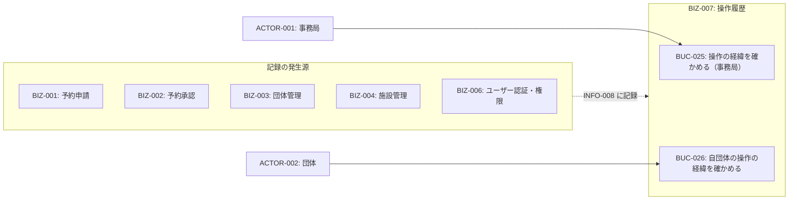
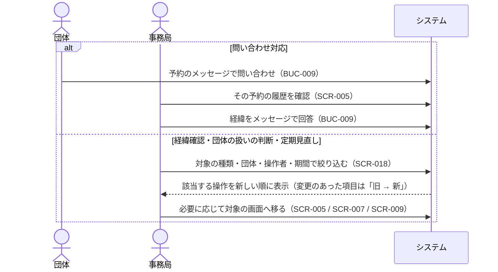
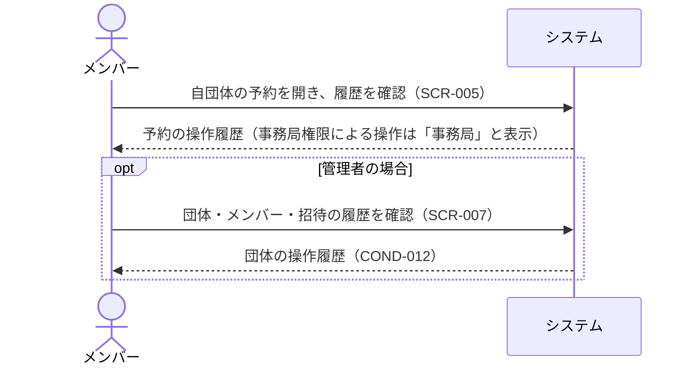
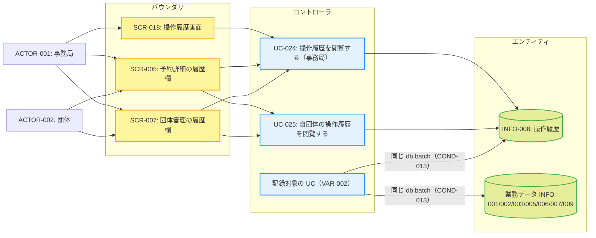

# BIZ-007: 操作履歴

予約・団体（メンバー・招待を含む）・施設・事務局権限への操作について、誰が・いつ・何を・どう変えたかを後から確かめられるようにするコンテキスト（GOAL-007）。

予約テーブルに残るのは作成者（created_by）と最終更新日時だけで、承認・却下・キャンセルした人や変更前の値は残らない。却下・キャンセルの理由（status_reason）は残るが、誰がいつ付けたかは残らない。団体の有効化・無効化、ロールの変更、施設の無効化も同様である。このコンテキストでは、それらの変更を1件ずつ操作履歴（INFO-008）に残す。

記録は既存の各コンテキストの業務の中で発生する。本コンテキストが独自に持つ業務は、記録を**見る**ことだけである。記録の書き込みは、各ユースケースが業務データの変更と同じ `db.batch` で行う（COND-013）。

## 対象外

- **認証・アカウントの記録**（ログインの成否・メールアドレスの変更・パスキーの登録と名前の変更・削除・ログイン中の端末のログアウト・氏名の変更）。不正利用・乗っ取りの調査は今回の目的から外した。ただし事務局権限の付与・剥奪は記録の対象に含む。
- **閲覧の記録**。記録するのは変更だけである。
- **障害の調査**。運用ログ（Workers Logs）の領分であり、失敗した操作も運用ログに残る（ADR-004）。
- **システムが行う処理**（メール送信・Google Calendar 同期）。操作者は常に人である。

## ビジネスコンテキスト図

## 操作履歴の開示範囲（COND-012）

| 記録対象の種類（VAR-003） | 事務局 |          自団体の管理者          | 自団体のメンバー | 他団体 |
| ------------------------- | :----: | :------------------------------: | :--------------: | :----: |
| 予約                      |   ○    |                ○                 |        ○         |   ×    |
| 団体                      |   ○    |                ○                 |        ×         |   ×    |
| メンバーシップ            |   ○    |                ○                 |        ×         |   ×    |
| 招待                      |   ○    |                ○                 |        ×         |   ×    |
| 施設/設備                 |   ○    |                ×                 |        ×         |   ×    |
| 事務局権限                |   ○    |                ×                 |        ×         |   ×    |
| 操作者の表示              | 個人名 | 事務局権限による操作は「事務局」 |       同左       |   —    |

## 業務フロー

### BUC-025: 操作の経緯を確かめる（事務局）

### BUC-026: 自団体の操作の経緯を確かめる

## ロバストネス図

記録は既存のユースケースが書き込み、UC-024・UC-025 が読み出す。

