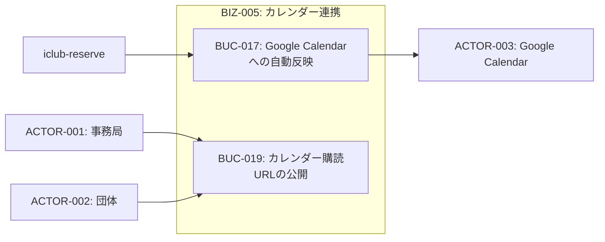
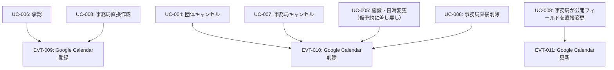

# BIZ-005: カレンダー連携

承認済み予約のGoogle Calendarへの自動登録・更新・削除を担うコンテキスト。

## ビジネスコンテキスト図

```mermaid
graph LR
    actor1["ACTOR-001: 事務局"]
    actor2["ACTOR-002: 団体"]
    system["iclub-reserve"]
    ext["ACTOR-003: Google Calendar"]

    subgraph biz5["BIZ-005: カレンダー連携"]
        buc17["BUC-017: Google Calendarへの自動反映"]
        buc19["BUC-019: カレンダー購読URLの公開"]
    end

    system --> buc17
    buc17 --> ext
    actor1 --> buc19
    actor2 --> buc19
```

## イベントトリガー一覧

```mermaid
graph TB
    uc006["UC-006: 承認"] --> evt009["EVT-009: Google Calendar登録"]
    uc008c["UC-008: 事務局直接作成"] --> evt009
    uc004["UC-004: 団体キャンセル"] --> evt010["EVT-010: Google Calendar削除"]
    uc007["UC-007: 事務局キャンセル"] --> evt010
    uc005["UC-005: 施設・日時変更（仮予約に差し戻し）"] --> evt010
    uc008d["UC-008: 事務局直接削除"] --> evt010
    uc008u["UC-008: 事務局が公開フィールドを直接変更"] --> evt011["EVT-011: Google Calendar更新"]
```
