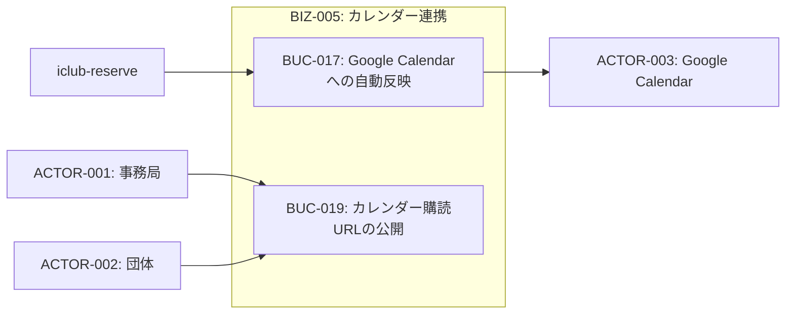
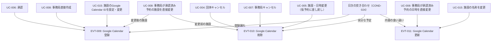
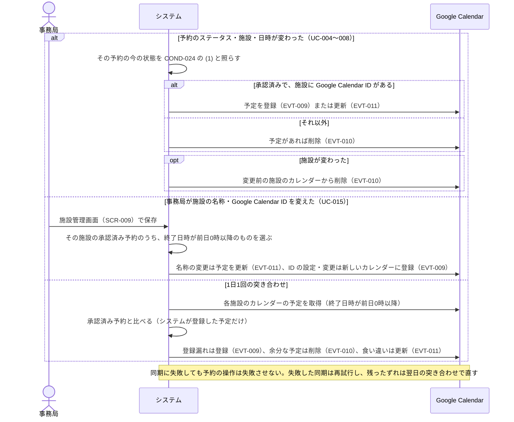

# BIZ-005: カレンダー連携

承認済み予約のGoogle Calendarへの自動登録・更新・削除を担うコンテキスト。

Google Calendarは購読URLを知っていれば誰でも閲覧できるため、COND-008の3段階のうち最も狭い開示範囲——施設名と日時だけ——を載せる。どの団体が使っているかは学内の利用者どうしで共有すれば足りる情報であり、外部に出す必要はないためである。

## カレンダーの持ち方

カレンダーは、事務局が引き継いで管理できる共有のGoogleアカウントで作る（REQ-026）。運営するのは学生であり、作った人の個人アカウントに置くと、その人が卒業したときにカレンダーを管理できる人がいなくなるためである。

システムはGoogle Service Accountを使い、予定の登録・更新・削除だけを行う。カレンダーの作成・公開設定は人が行う。施設を追加するときの手順は次のとおり。

1. 共有のGoogleアカウントで、施設・設備ごとのカレンダーを作る。
2. カレンダーを一般公開する。
3. Service Accountのメールアドレスに「予定の変更」の権限を共有する。
4. 施設管理画面（SCR-009）で、そのカレンダーのIDを施設に設定する。保存するときに、システムが予定を書き込めることを確かめる（COND-025）。

## 同期の考え方

予約の操作ごとに「登録せよ」「削除せよ」と命令を送るのではなく、予約の今の状態を見て、カレンダーをそれに合わせる（COND-024）。EVT-009・EVT-010・EVT-011は、合わせた結果として行う操作の種類である。こうしておくと、承認の直後にキャンセルされるなど操作が続いても、同期の順番に関わらず最後は正しい状態になり、失敗した同期をやり直しても予定が二重にならない。

予定のタイトルは施設名とする。施設ごとのカレンダーを1つにまとめて表示する使い方（利用者が複数のカレンダーを重ねて見る場合や、将来すべての施設をまとめたカレンダーを用意する場合）でも、どの施設の予約かが予定だけで分かるようにするためである。

施設の名称の変更やGoogle Calendar IDの設定・変更、日次の突き合わせのように、多くの予約をまとめて反映する処理は、終了日時が前日0時以降の予約だけを扱う。過去の予約まで遡ると、件数に比例して処理が重くなるためである。

## ビジネスコンテキスト図

## イベントトリガー一覧

## 業務フロー

### BUC-017: Google Calendarへの自動反映

