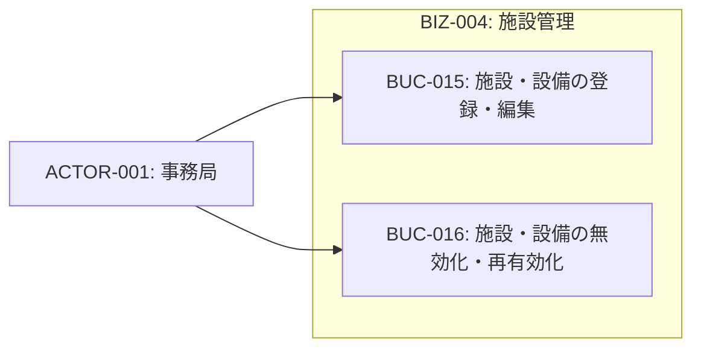
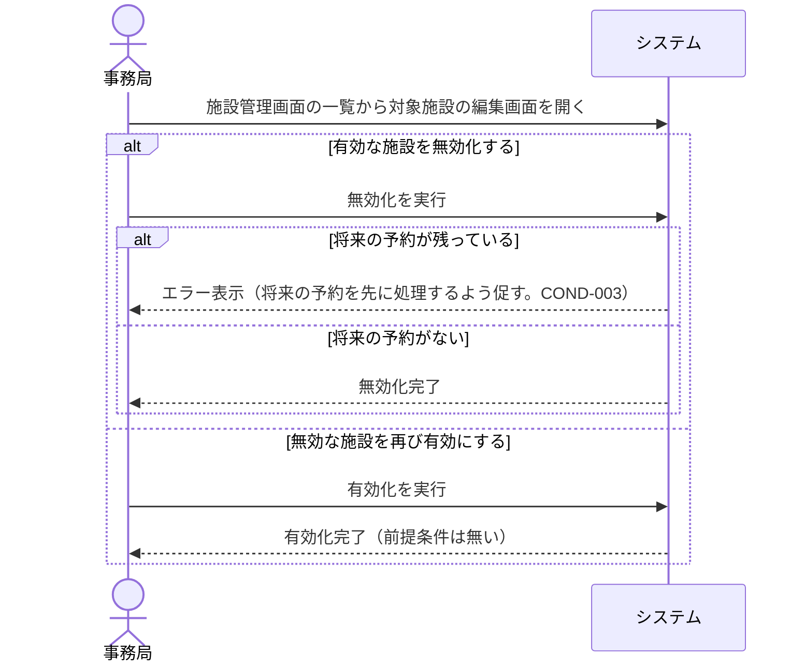

# BIZ-004: 施設管理

事務局による施設・設備の登録・編集・有効化/無効化を担うコンテキスト。

## 施設・設備一覧（初期データ）

| 名称                           | 種別 |
| ------------------------------ | ---- |
| 吹田：C棟2階占有 イベント予約  | 部屋 |
| 吹田：3Dプリンター 積層タイプ  | 設備 |
| 吹田：3Dプリンター 積層タイプ2 | 設備 |
| 吹田：3Dプリンター 光造形機    | 設備 |
| 吹田：レーザーカッター         | 設備 |
| 吹田：CAD用パソコン            | 設備 |
| 豊中試作室                     | 部屋 |
| 豊中試作室：3Dプリンター       | 設備 |

> 注: 「種別」はINFO-002の属性として持たず、施設名称に含める運用とする。

## ビジネスコンテキスト図

## 業務フロー

### BUC-016: 施設・設備の無効化・再有効化

