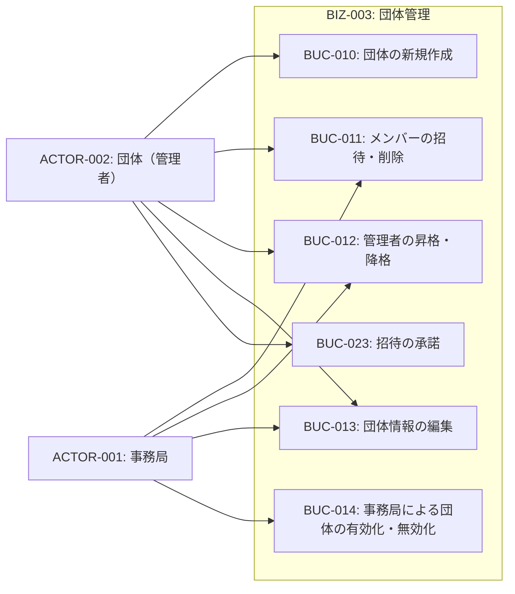
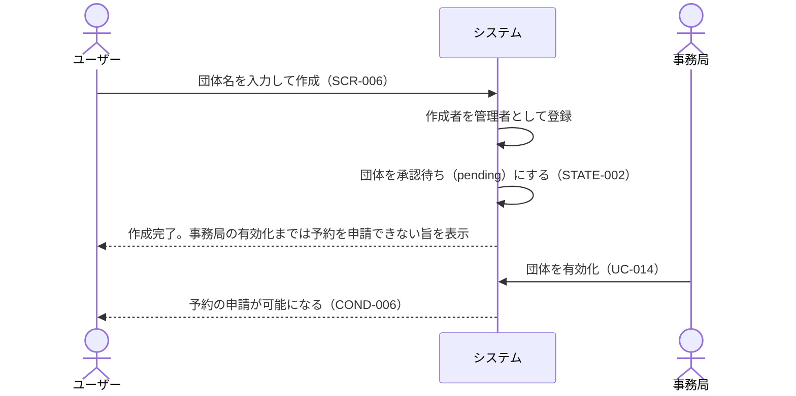
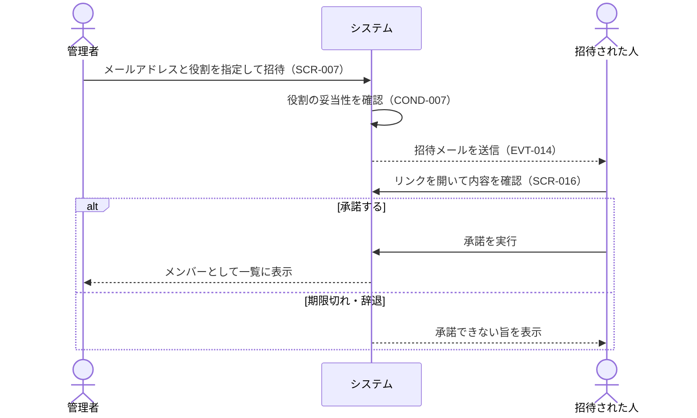

# BIZ-003: 団体管理

団体アカウントの作成・メンバー管理・管理者管理・団体情報編集・有効化/無効化を担うコンテキスト。

団体は誰でも作成できるが、作成直後は承認待ちであり、事務局が有効化するまで予約を申請できない（COND-006）。これにより「作成の手続きは軽く、利用の可否は事務局が制御する」という運用になる。

また、団体は削除せず無効化で運用する。予約が紐づく団体を消すと過去の利用記録をたどれなくなるためである。

## ビジネスコンテキスト図

## 業務フロー

### BUC-010: 団体の新規作成

### BUC-011 / BUC-023: メンバーの招待と承諾

