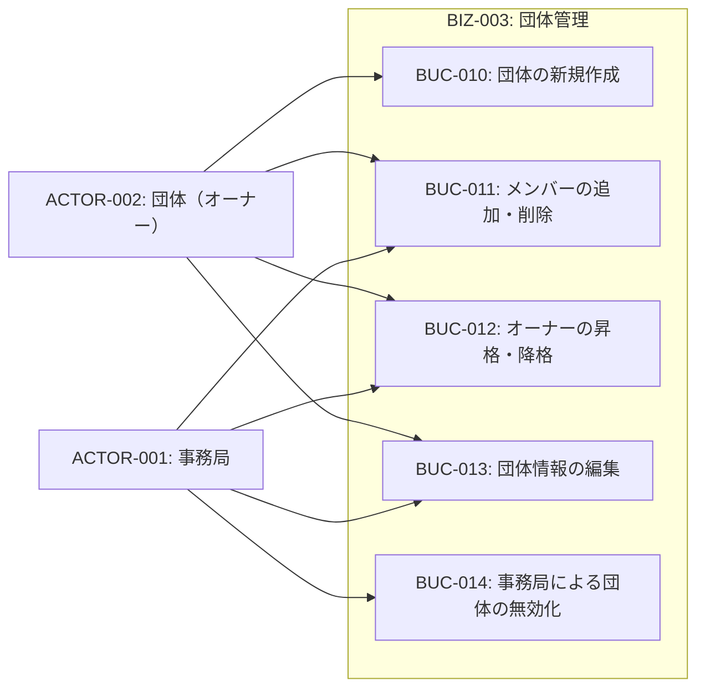
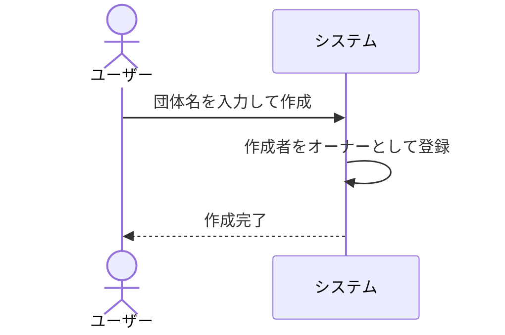

# BIZ-003: 団体管理

団体アカウントの作成・メンバー管理・オーナー管理・団体情報編集・無効化を担うコンテキスト。

## ビジネスコンテキスト図

```mermaid
graph LR
    actor1["ACTOR-001: 事務局"]
    actor2["ACTOR-002: 団体（オーナー）"]

    subgraph biz3["BIZ-003: 団体管理"]
        buc10["BUC-010: 団体の新規作成"]
        buc11["BUC-011: メンバーの追加・削除"]
        buc12["BUC-012: オーナーの昇格・降格"]
        buc13["BUC-013: 団体情報の編集"]
        buc14["BUC-014: 事務局による団体の無効化"]
    end

    actor2 --> buc10
    actor2 --> buc11
    actor2 --> buc12
    actor2 --> buc13
    actor1 --> buc11
    actor1 --> buc12
    actor1 --> buc13
    actor1 --> buc14
```

## 業務フロー

### BUC-010: 団体の新規作成

```mermaid
sequenceDiagram
    actor ユーザー
    participant システム

    ユーザー->>システム: 団体名を入力して作成
    システム->>システム: 作成者をオーナーとして登録
    システム-->>ユーザー: 作成完了
```
