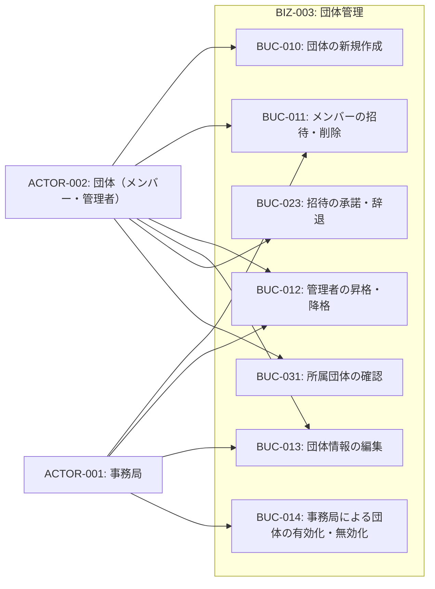
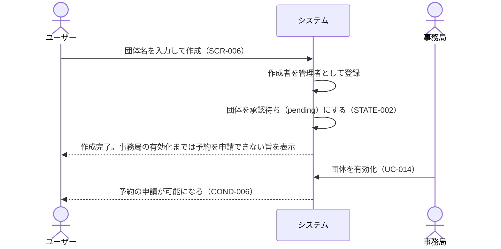
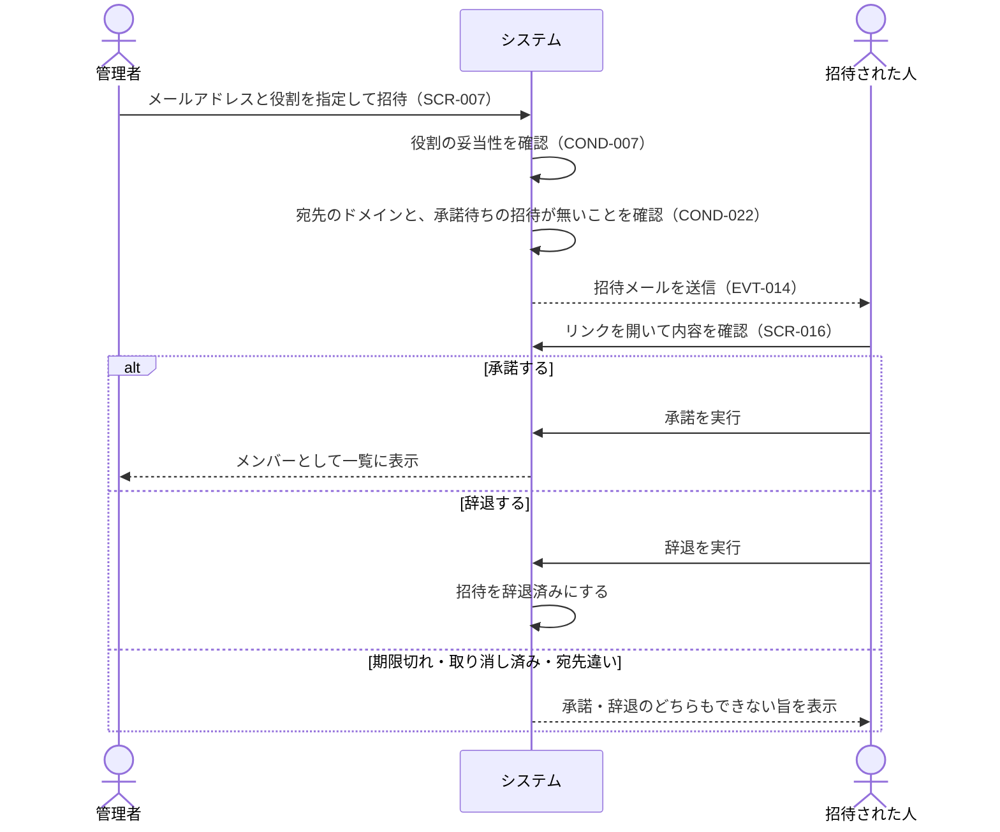
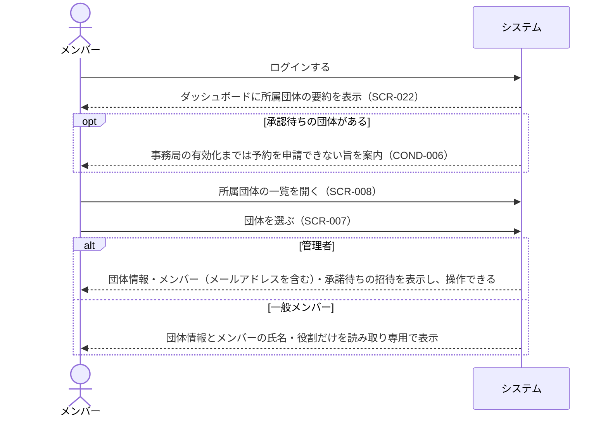

# BIZ-003: 団体管理

団体アカウントの作成・メンバー管理・管理者管理・団体情報編集・有効化/無効化を担うコンテキスト。

団体は誰でも作成できるが、作成直後は承認待ちであり、事務局が有効化するまで予約を申請できない（COND-006）。これにより「作成の手続きは軽く、利用の可否は事務局が制御する」という運用になる。

また、団体は削除せず無効化で運用する。予約が紐づく団体を消すと過去の利用記録をたどれなくなるためである。

団体の一覧・詳細は所属しているメンバーと事務局にしか見せない（UC-035）。一般メンバーにも自団体の団体情報とメンバーの氏名・役割は見せるが、メンバーのメールアドレスと承諾待ちの招待は、メンバー管理を担う管理者と事務局に限る。加えて、所属していない団体については存在の有無自体を伏せる（COND-011）。学生団体の登録の有無は、その団体が活動しているかどうかを外部に示す情報になりうるためである。ただし秘匿の対象は団体そのものを引く経路に限る。他団体の予約に団体名を表示することはCOND-008が定めた仕様であり、こちらとは矛盾しない。また、招待を受け取った人は承諾を判断する必要があるため、招待が有効な間は招待元の団体名を確認できる。

## ビジネスコンテキスト図

## 業務フロー

### BUC-010: 団体の新規作成

### BUC-011 / BUC-023: メンバーの招待と承諾

### BUC-031: 所属団体の確認

