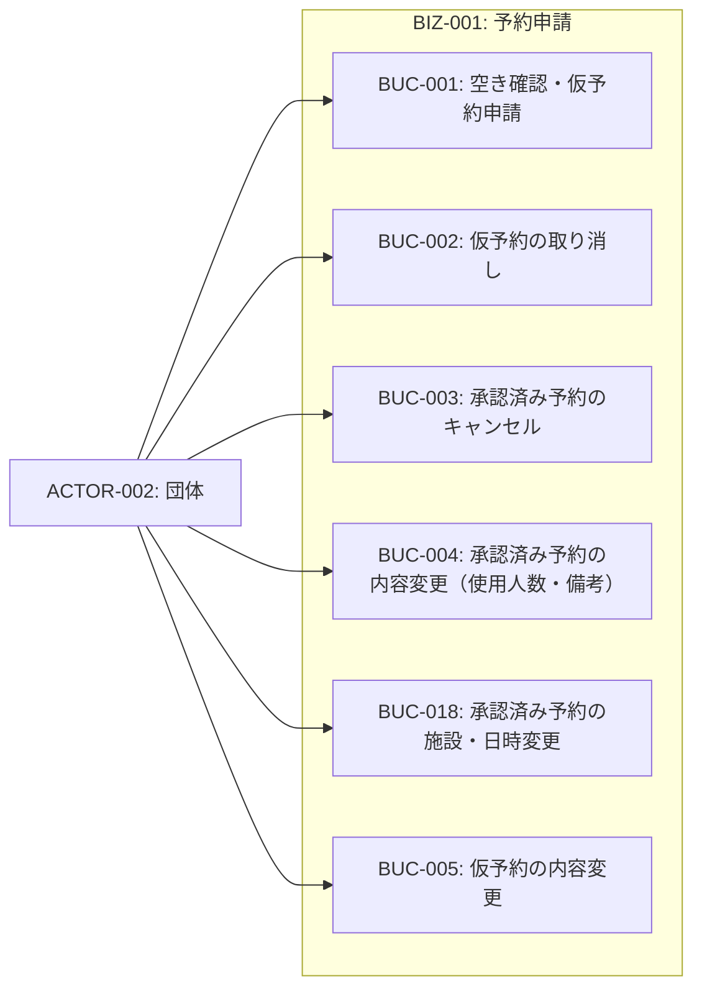
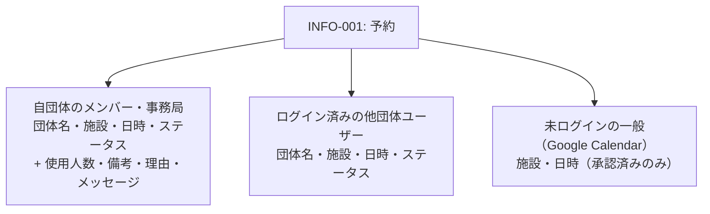
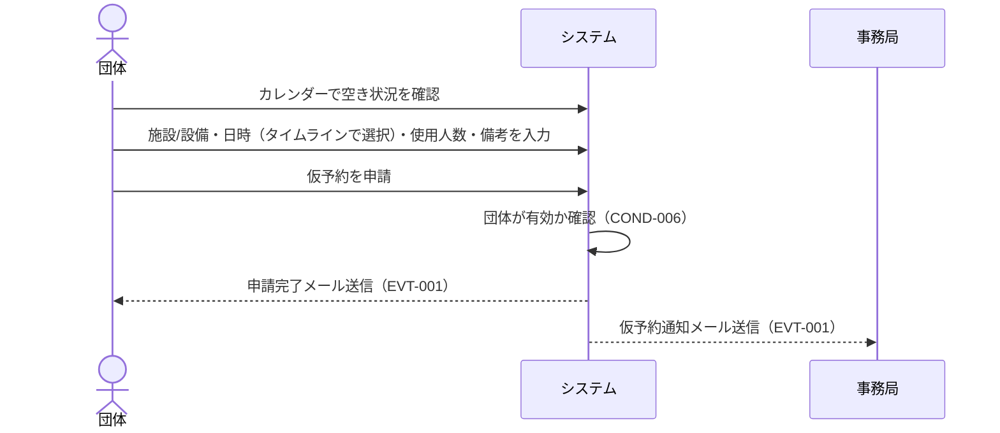
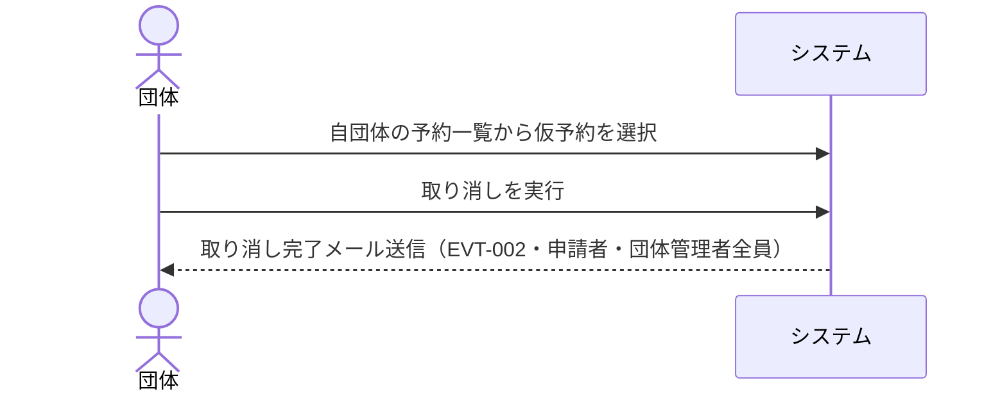
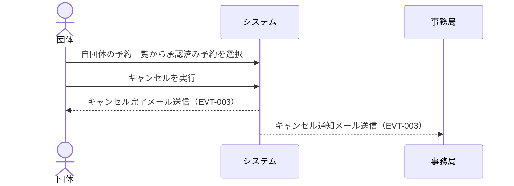
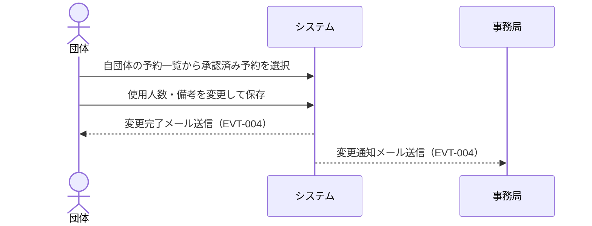
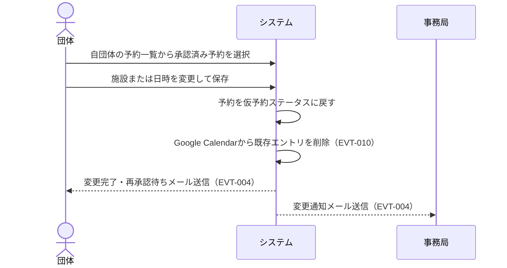
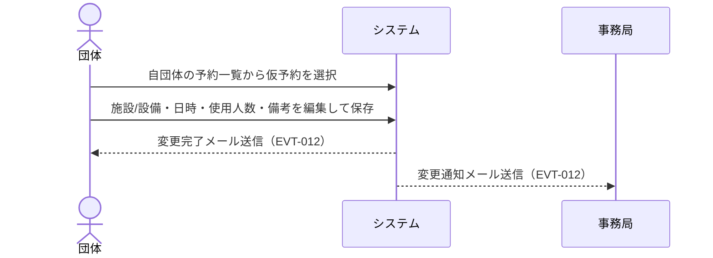

# BIZ-001: 予約申請

団体による施設・設備の空き確認、仮予約申請・取り消し・キャンセル・変更を担うコンテキスト。

予約の情報は「誰が見るか」で開示範囲が変わる（COND-008）。空き状況の把握に必要な最小限——団体名・施設・日時・ステータス——はログイン済みの利用者どうしで共有し、使用人数や備考、事務局とのやり取りは自団体と事務局に閉じる。さらに外部へ公開されるGoogle Calendarでは団体名も伏せ、施設と日時だけを載せる。

## ビジネスコンテキスト図

## 予約の可視範囲（COND-008）

## 業務フロー

### BUC-001: 空き確認・仮予約申請

### BUC-002: 仮予約の取り消し

### BUC-003: 承認済み予約のキャンセル

### BUC-004: 承認済み予約の内容変更（使用人数・備考）

### BUC-018: 承認済み予約の施設・日時変更

### BUC-005: 仮予約の内容変更

