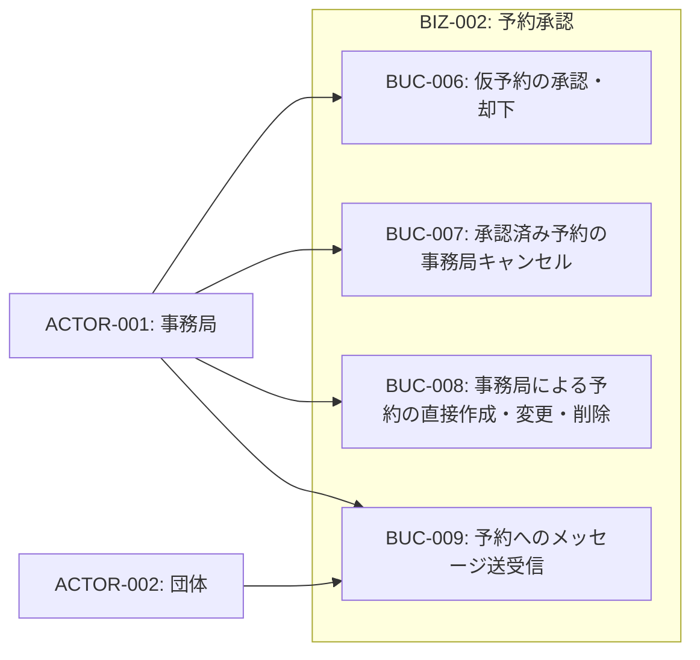
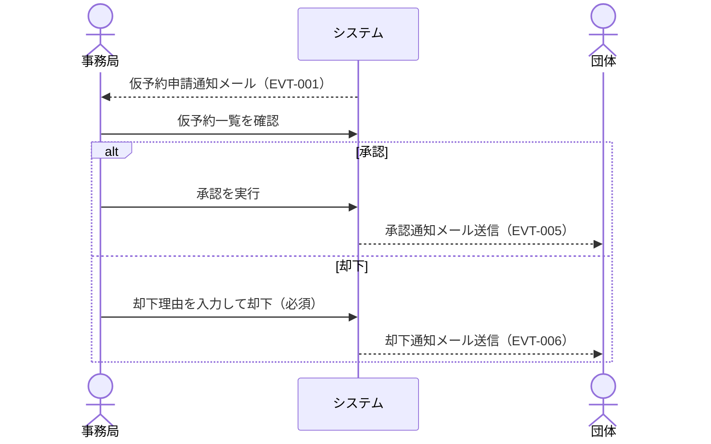
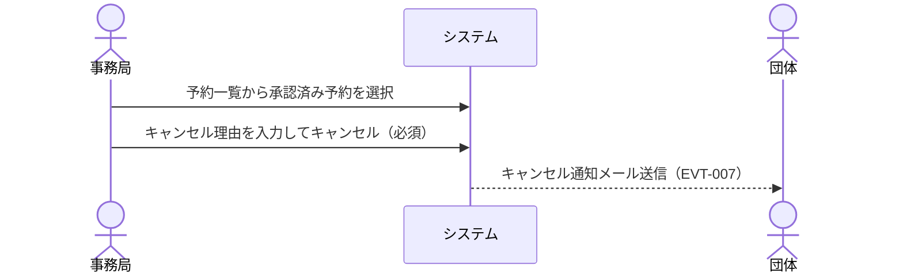

# BIZ-002: 予約承認

事務局による仮予約の承認・却下、直接予約の作成・変更・削除、メッセージ送受信を担うコンテキスト。

## ビジネスコンテキスト図

```mermaid
graph LR
    actor1["ACTOR-001: 事務局"]
    actor2["ACTOR-002: 団体"]

    subgraph biz2["BIZ-002: 予約承認"]
        buc6["BUC-006: 仮予約の承認・却下"]
        buc7["BUC-007: 承認済み予約の事務局キャンセル"]
        buc8["BUC-008: 事務局による予約の直接作成・変更・削除"]
        buc9["BUC-009: 予約へのメッセージ送受信"]
    end

    actor1 --> buc6
    actor1 --> buc7
    actor1 --> buc8
    actor1 --> buc9
    actor2 --> buc9
```

## 業務フロー

### BUC-006: 仮予約の承認・却下

```mermaid
sequenceDiagram
    actor 事務局
    participant システム
    actor 団体

    システム-->>事務局: 仮予約申請通知メール（EVT-001）
    事務局->>システム: 仮予約一覧を確認
    alt 承認
        事務局->>システム: 承認を実行
        システム-->>団体: 承認通知メール送信（EVT-005）
    else 却下
        事務局->>システム: 却下理由を入力して却下（必須）
        システム-->>団体: 却下通知メール送信（EVT-006）
    end
```

### BUC-007: 承認済み予約の事務局キャンセル

```mermaid
sequenceDiagram
    actor 事務局
    participant システム
    actor 団体

    事務局->>システム: 予約一覧から承認済み予約を選択
    事務局->>システム: キャンセル理由を入力してキャンセル（必須）
    システム-->>団体: キャンセル通知メール送信（EVT-007）
```
