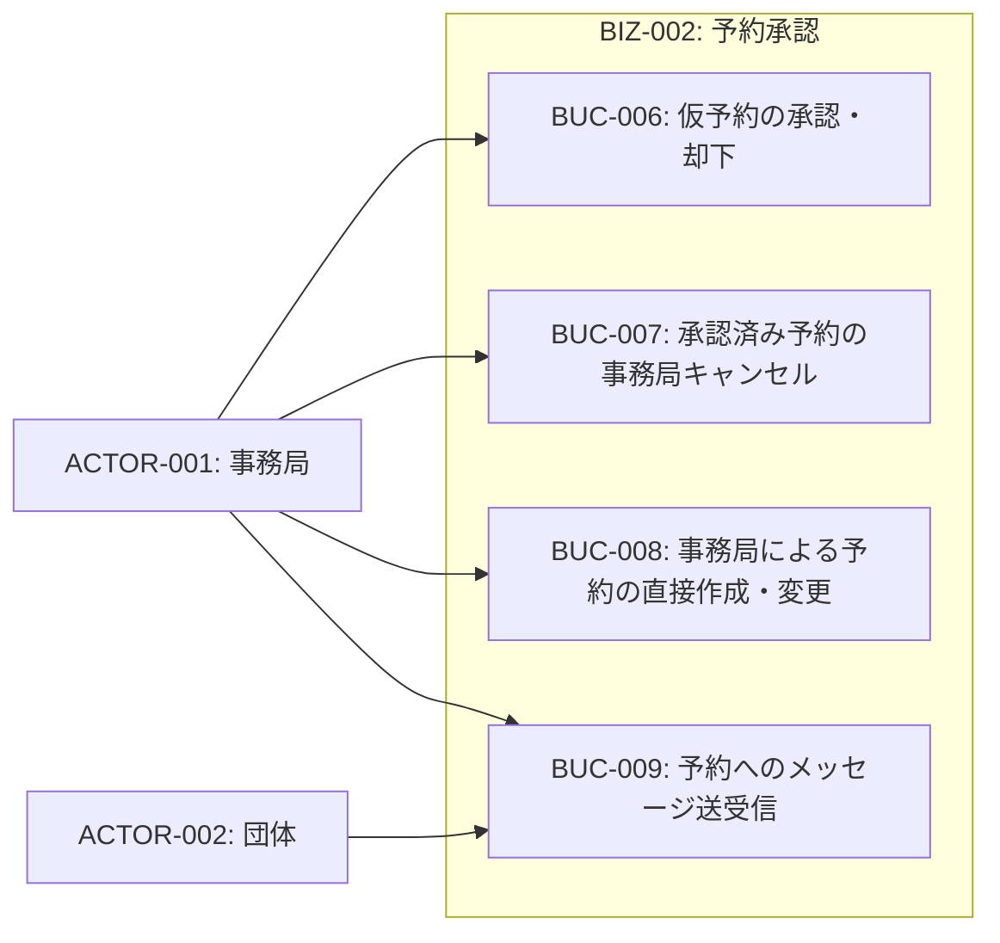
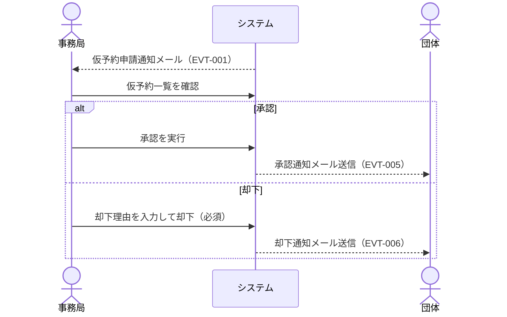
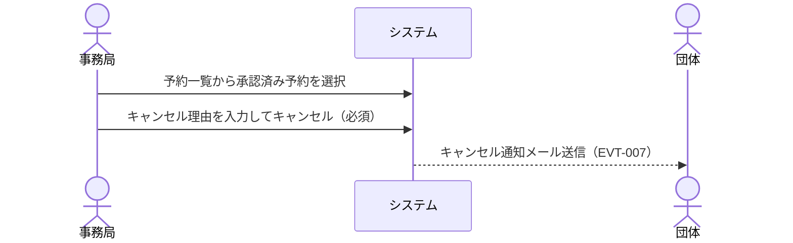
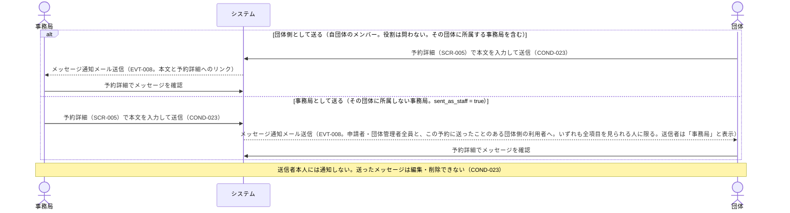

# BIZ-002: 予約承認

事務局による仮予約の承認・却下、直接予約の作成・変更、メッセージ送受信を担うコンテキスト。

事務局の権限は団体内ロール（VAR-001）とは別の軸にあり、団体への所属に関わらず全団体・全予約に及ぶ（COND-009）。判定の根拠は INFO-006.is_staff である。

事務局は予約を削除できない。取りやめる場合は事務局キャンセルまたは却下で、理由とともに記録を残す。削除すると予約詳細ごと消え、団体が「いつ・なぜ無くなったか」を確かめられなくなるためである（GOAL-007）。事務局による承認・却下・キャンセル・直接作成・直接変更は操作履歴（BIZ-007）に記録され、事務局権限によって初めて許された操作は団体側に「事務局」と表示される（COND-012）。メッセージの送信（UC-009）は操作履歴の対象外である（メッセージ自体に送信者と日時が残る）。そのため、送ったメッセージは編集も削除もできない（COND-023）。

## ビジネスコンテキスト図

## 業務フロー

### BUC-006: 仮予約の承認・却下

### BUC-007: 承認済み予約の事務局キャンセル

### BUC-009: 予約へのメッセージ送受信

