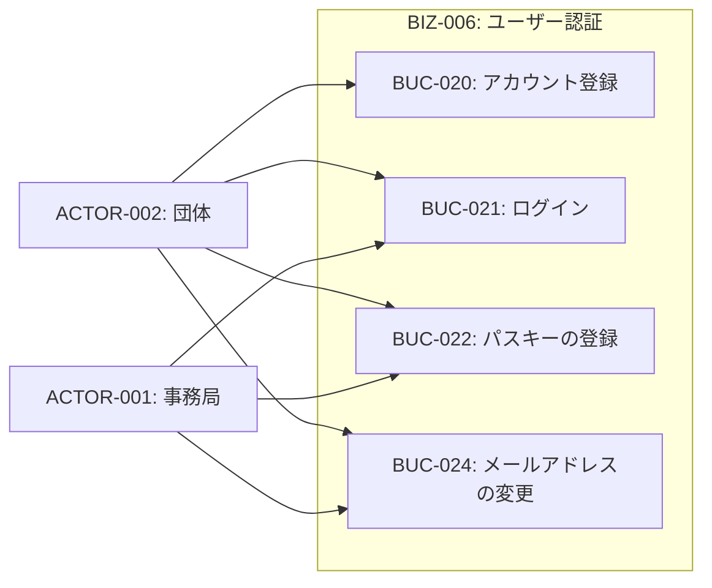
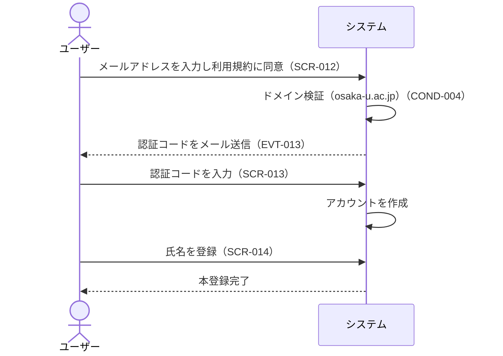
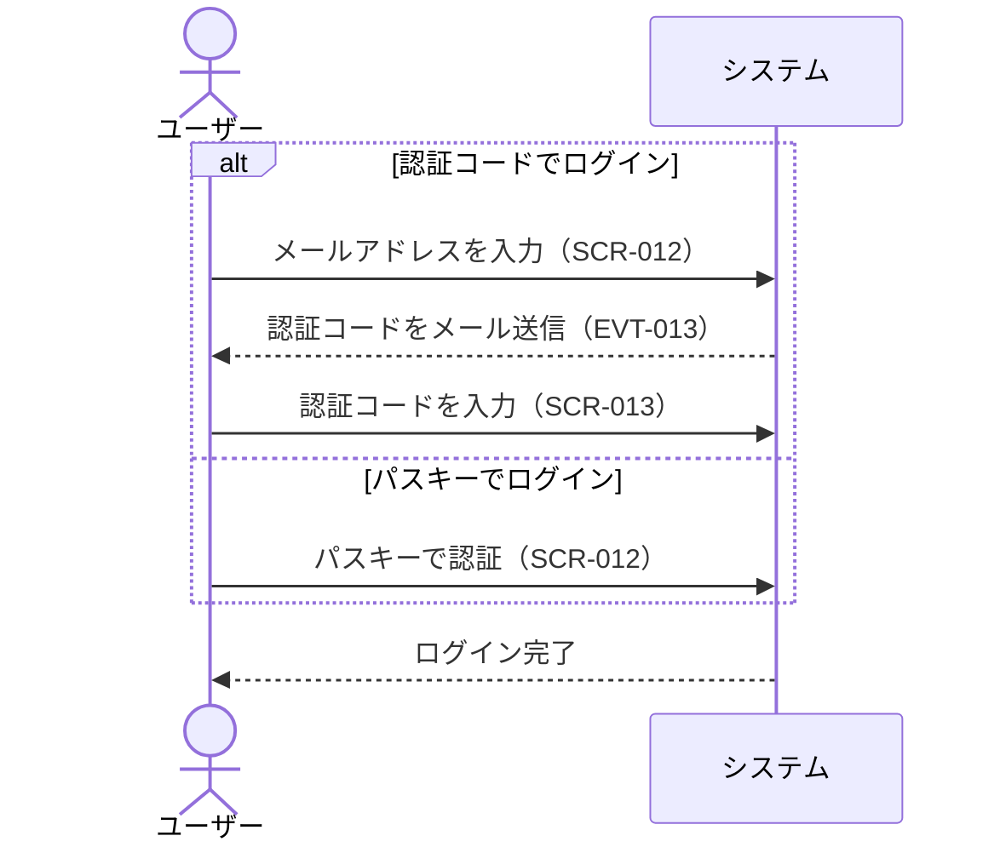
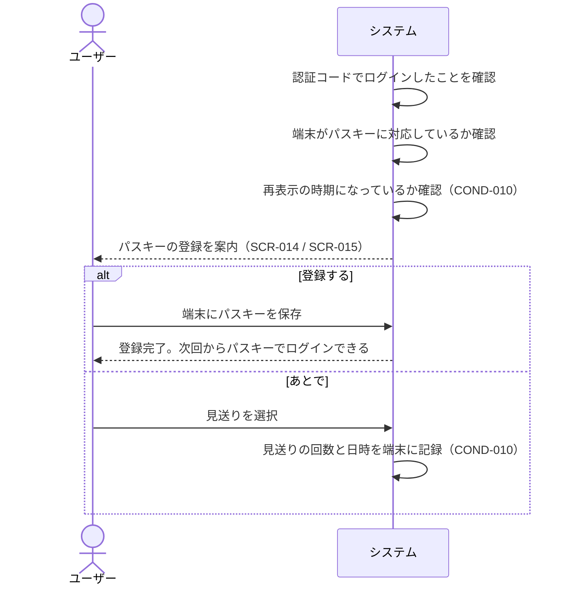
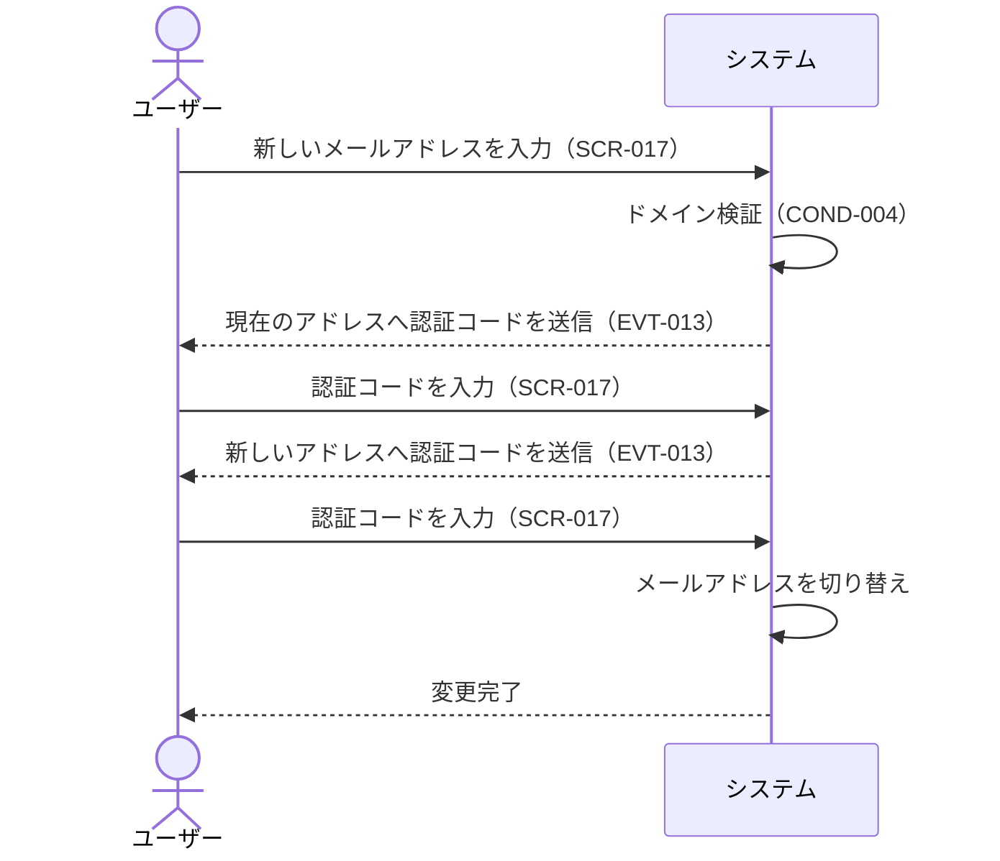

# BIZ-006: ユーザー認証

アカウントを作れるのをosaka-u.ac.jpドメイン（サブドメイン含む）のメールアドレスを持つ阪大関係者に限ることで、利用者を絞り込むコンテキスト。アカウント登録・メール認証・ログインを担う。

ドメインで絞るのは入口だけである。既にアカウントを持つ人はドメインを問わずログインでき、メールアドレスの変更時には変更後のアドレスが再びこの制限を受ける（COND-004）。

ログインの手段はメール認証コードとパスキーの2つで、パスワードは扱わない。パスワードを持たないため、パスワードリセットも不要である（将来のSSO連携を見据えた判断。詳細は`docs/adr/`を参照）。

メールアドレスは本人確認の唯一の手がかりであるため、その変更（BUC-024）には現在のアドレスと新しいアドレスの双方で認証コードによる確認を要する。現在のアドレスを確認しないと、端末を一時的に奪われただけでアカウントごと乗っ取られてしまうためである。

## ビジネスコンテキスト図

## 業務フロー

### BUC-020: アカウント登録

### BUC-021: ログイン

### BUC-022: パスキーの登録

### BUC-024: メールアドレスの変更

