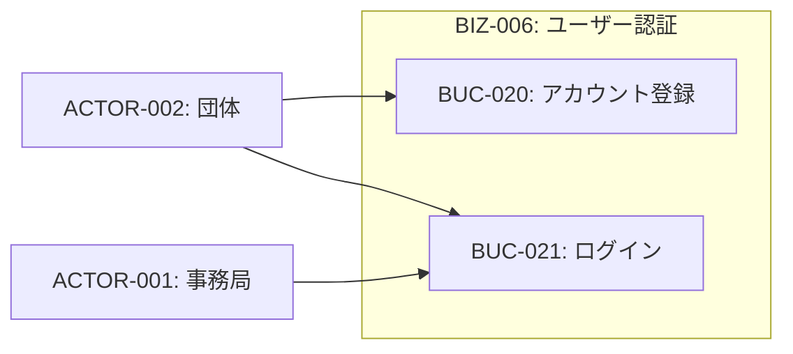
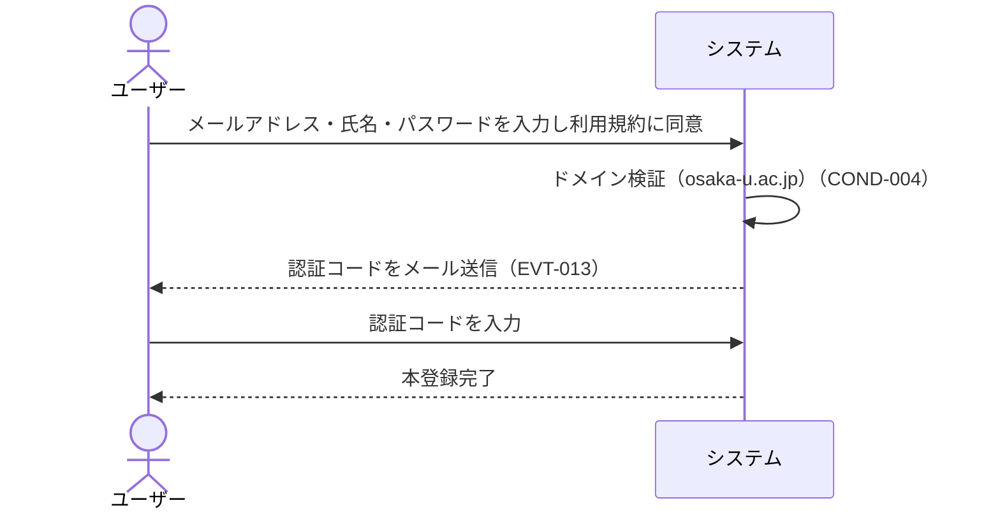
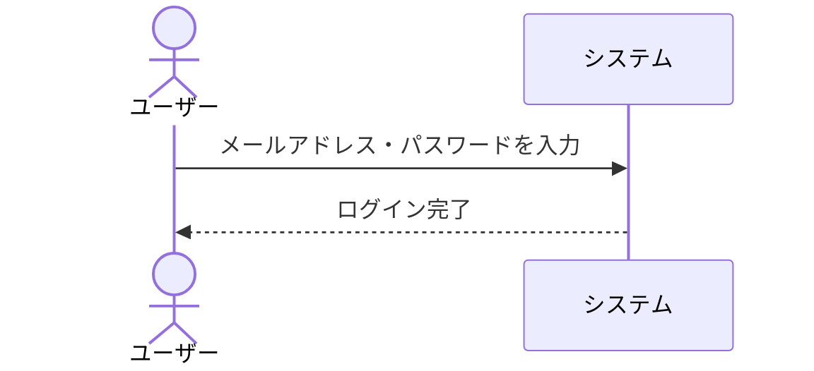

# BIZ-006: ユーザー認証

osaka-u.ac.jpドメインのメールアドレスを持つ阪大関係者のみがシステムを利用できるよう、アカウント登録・メール認証・ログインを担うコンテキスト。パスワードリセットは将来のSSO連携を見据えてMVPから除外。

## ビジネスコンテキスト図

## 業務フロー

### BUC-020: アカウント登録

### BUC-021: ログイン

