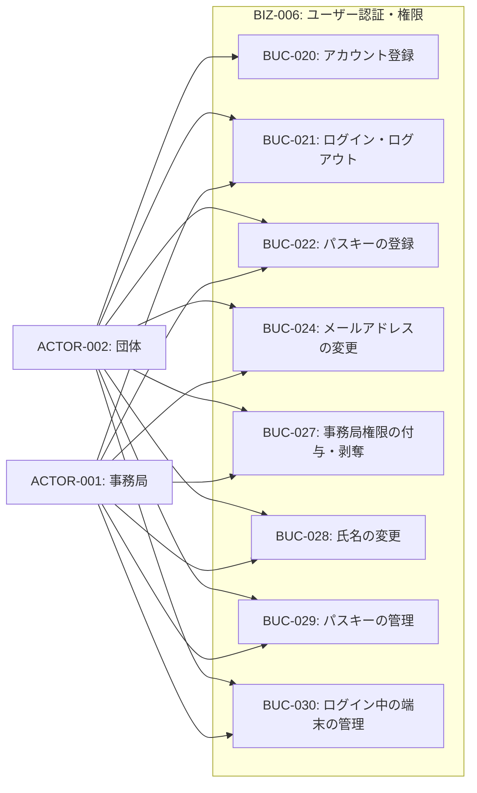
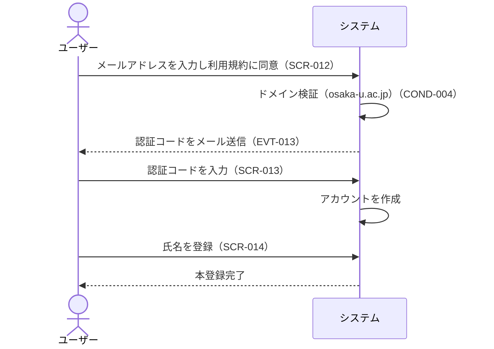
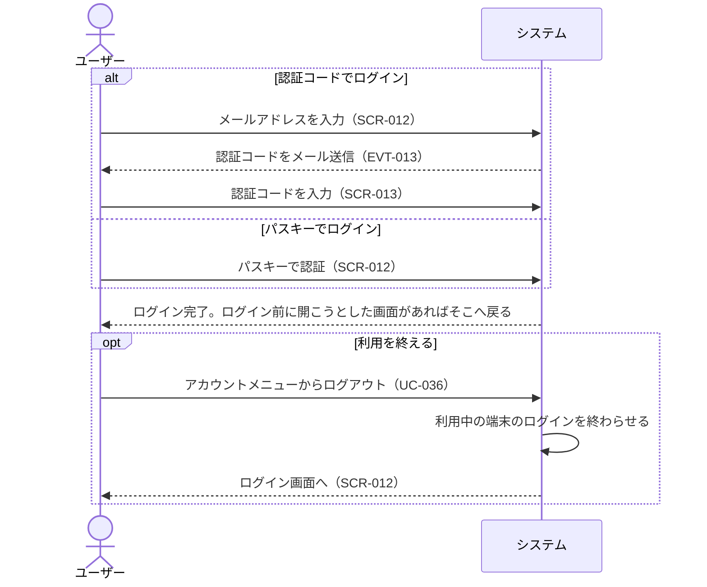
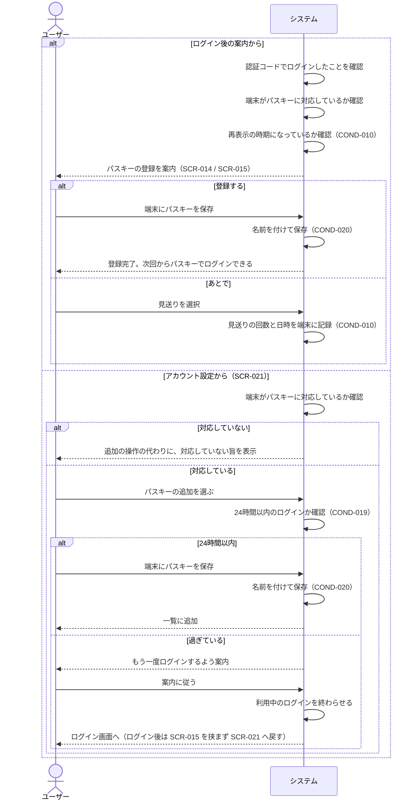
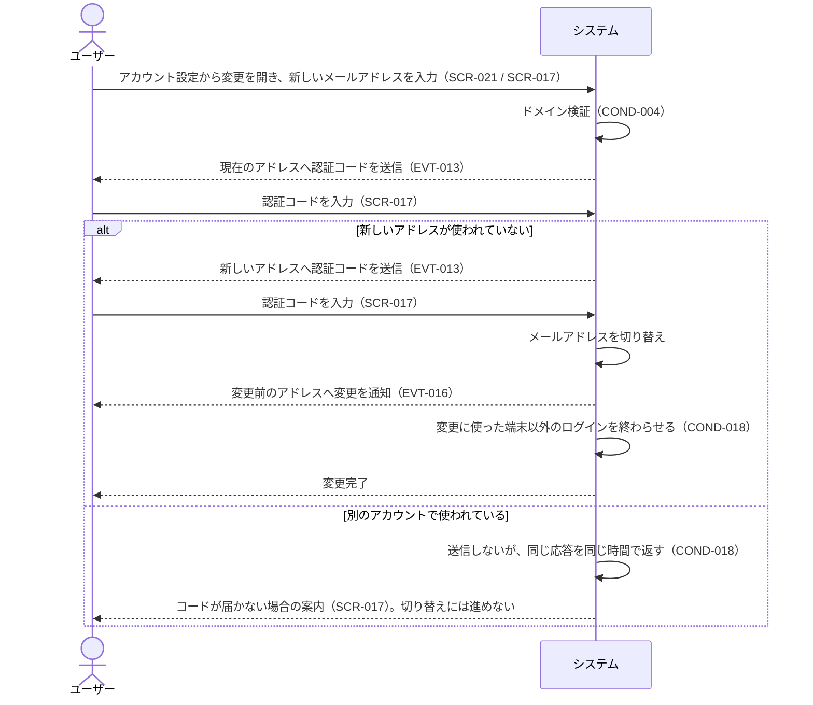
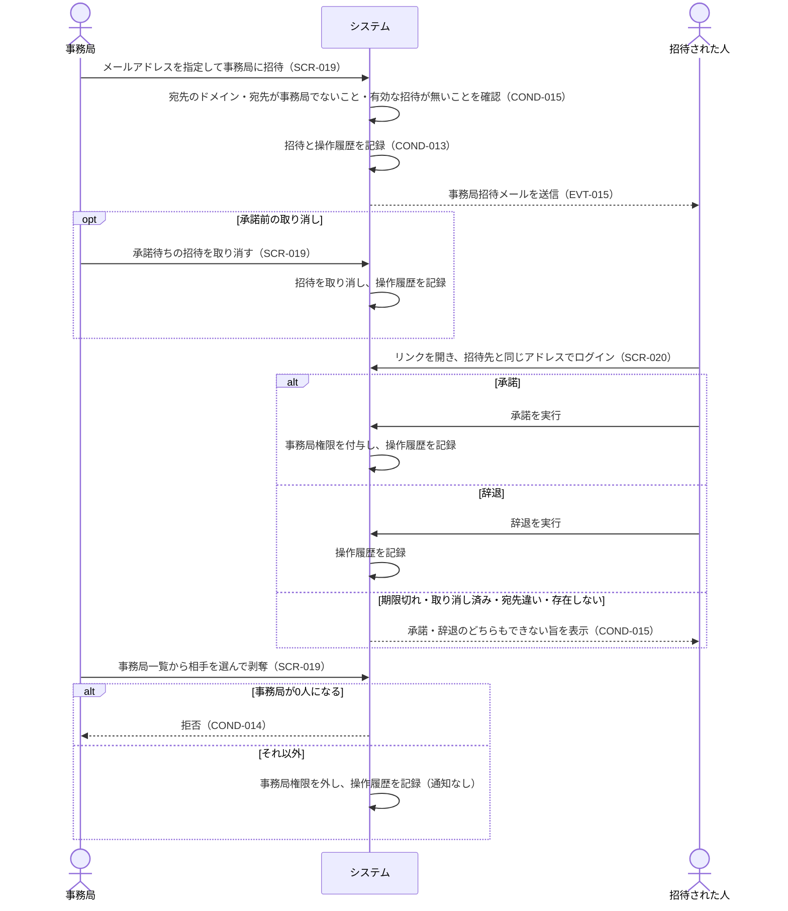
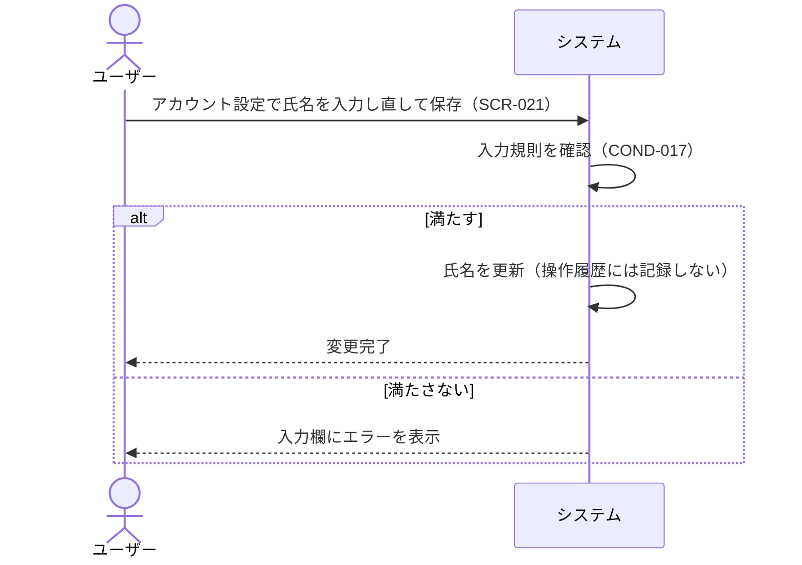
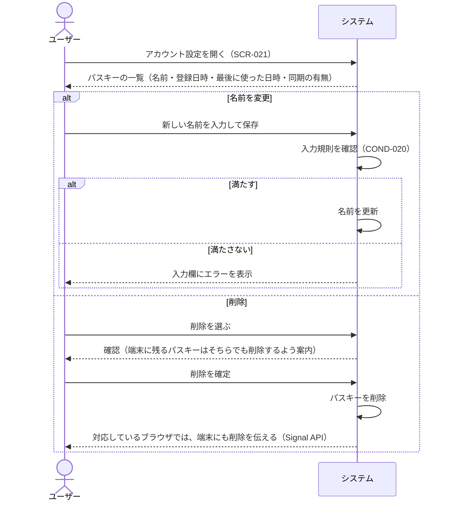
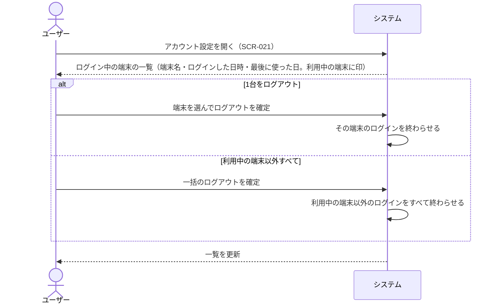

# BIZ-006: ユーザー認証・権限

アカウントを作れるのをosaka-u.ac.jpドメイン（サブドメイン含む）のメールアドレスを持つ阪大関係者に限ることで、利用者を絞り込むコンテキスト。アカウント登録・メール認証・ログイン、利用者自身によるアカウント設定、事務局権限の付与・剥奪を担う。

ドメインで絞るのは入口だけである。既にアカウントを持つ人はドメインを問わずログインでき、メールアドレスの変更時には変更後のアドレスが再びこの制限を受ける（COND-004）。

ログインの手段はメール認証コードとパスキーの2つで、パスワードは扱わない。パスワードを持たないため、パスワードリセットも不要である（将来のSSO連携を見据えた判断。詳細は`docs/adr/`を参照）。

メールアドレスは本人確認の唯一の手がかりであるため、その変更（BUC-024）には現在のアドレスと新しいアドレスの双方で認証コードによる確認を要する。現在のアドレスを確認しないと、端末を一時的に奪われただけでアカウントごと乗っ取られてしまうためである。

利用者が自分のアカウントを管理するアカウント設定（SCR-021）もこのコンテキストに置く。氏名の変更（BUC-028）、メールアドレスの変更（BUC-024）、パスキーの追加と管理（BUC-022・BUC-029）、ログイン中の端末の管理（BUC-030）を1ページにまとめる。氏名は、事務局が「誰がいつ利用したか」（GOAL-001）を確かめられるよう本名を求める（COND-017）。これらの操作はいずれも操作履歴（BIZ-007）に記録しない。GOAL-007 は認証・アカウントまわりの記録を対象外としているためである（事務局権限の付与・剥奪だけは例外として記録する）。

氏名とメールアドレスの変更を記録しないため、過去の予約や操作履歴は、その時点の氏名ではなく今の氏名で表示される。「誰が利用したか」は利用者ID（INFO-006.id）で一貫してたどれるので、GOAL-001 は損なわれない。一方、ある時点でその人が何と名乗っていたかは分からなくなる。本名を登録してもらう前提では困る場面が少ないと判断し、このリスクを受け入れる。

パスキーとログイン中の端末は、利用者が自分で見て操作する情報になったため、情報モデルにも INFO-010・INFO-011 として載せる。パスキーの追加だけは、開いたままの端末から他人にログインの手段を足されないよう、24時間以内のログインを求める（COND-019）。削除やログアウトはログインの手段を減らす操作なので、この条件を課さない。

事務局権限（INFO-006.is_staff）の付与・剥奪（BUC-027）もこのコンテキストで扱う。以前は DB を直接書き換えるしかなく、誰がいつ権限を与えたかが残らなかった。画面から操作できるようにし、操作履歴（BIZ-007）に記録する。付与は団体の招待（BUC-011・BUC-023）と同じく招待と承諾で行い、宛先本人だけが承諾できる（COND-015）。最初の1人の事務局だけは、これまでどおり DB またはシードで設定する。以降は COND-014 により0人になることはない。

## 対象外

- **退会**（利用者自身によるアカウントの削除）。
- **事務局による他の利用者の氏名・メールアドレスの変更**。アカウント設定（SCR-021）は本人だけが使う。
- **アカウント設定の操作の記録**。氏名・メールアドレスの変更、パスキーの登録・名前の変更・削除、ログイン中の端末のログアウトは操作履歴に残さない（GOAL-007）。
- **端末に保存されたパスキーの表示名の更新**。メールアドレスを変えても、端末側の表示名は変更前のアドレスのまま残る（COND-018）。

## ビジネスコンテキスト図

## 業務フロー

### BUC-020: アカウント登録

### BUC-021: ログイン・ログアウト

### BUC-022: パスキーの登録

### BUC-024: メールアドレスの変更

### BUC-027: 事務局権限の付与・剥奪

### BUC-028: 氏名の変更

### BUC-029: パスキーの管理

### BUC-030: ログイン中の端末の管理

