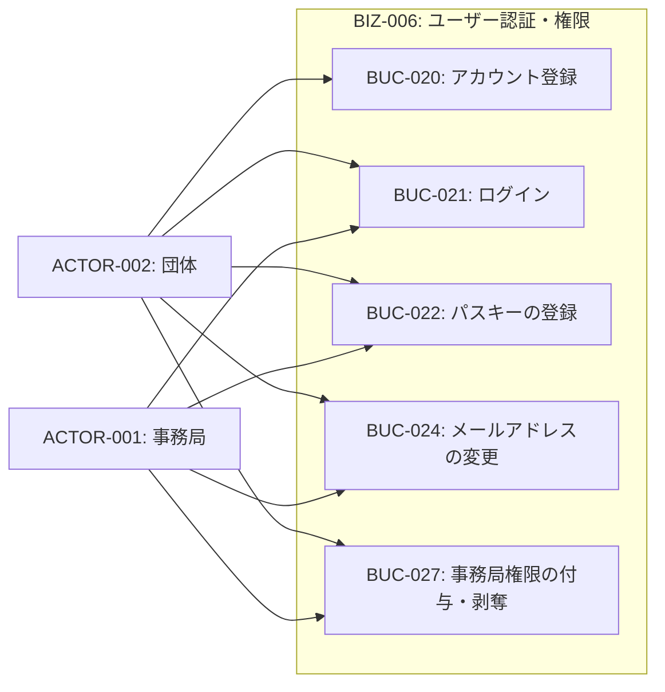
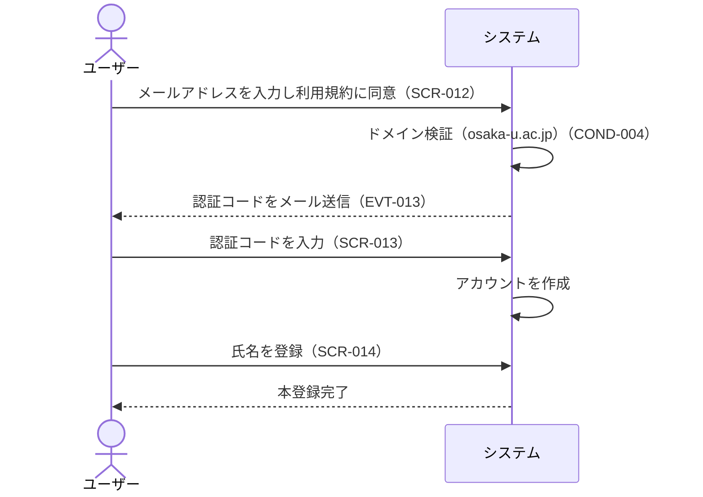
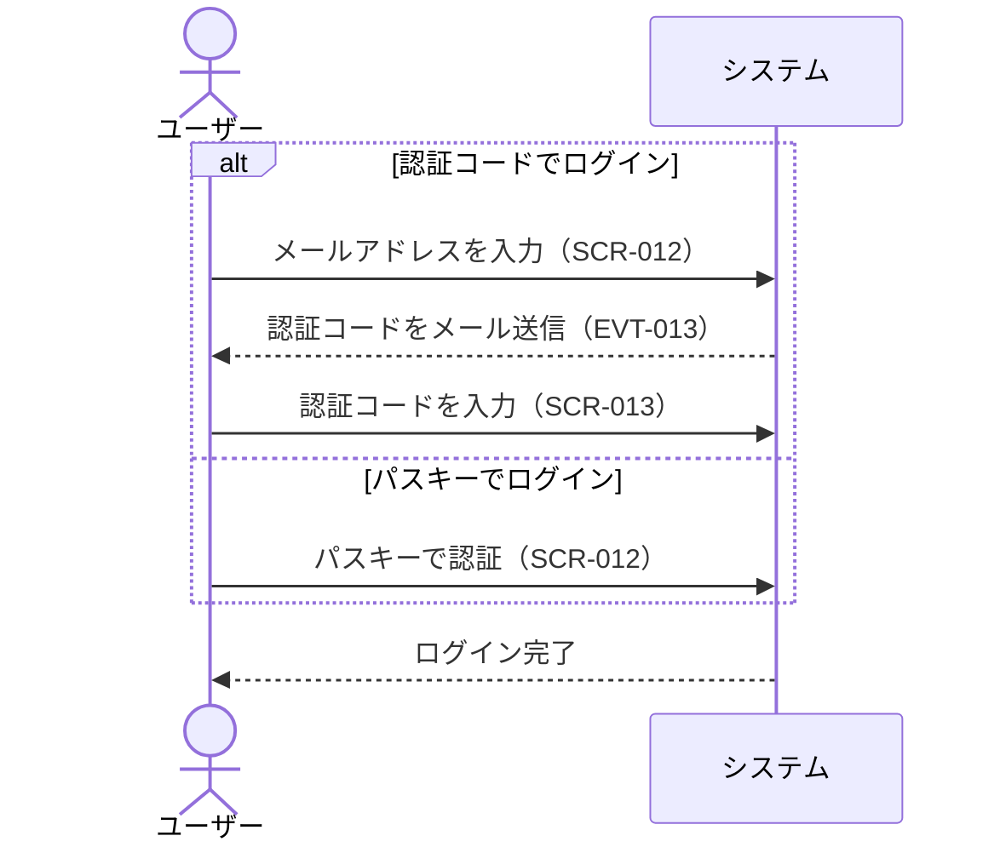
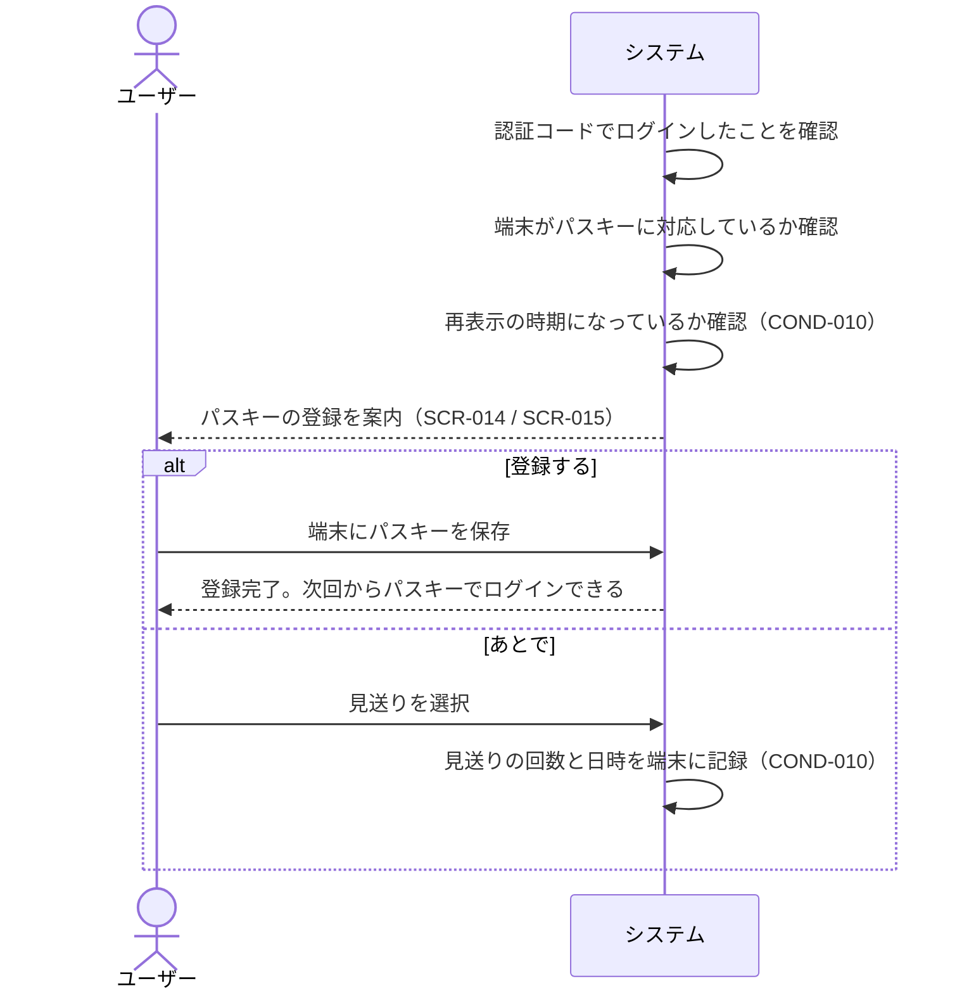
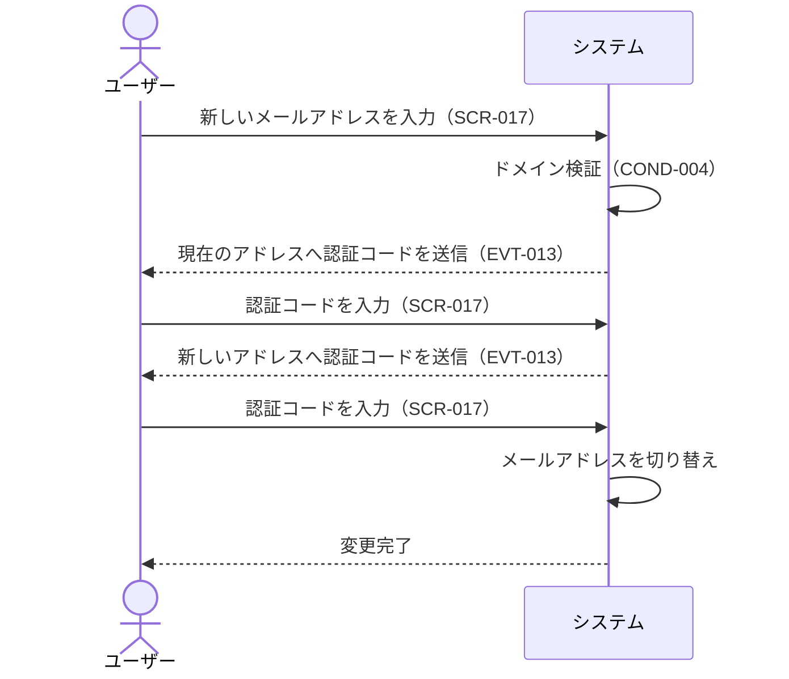
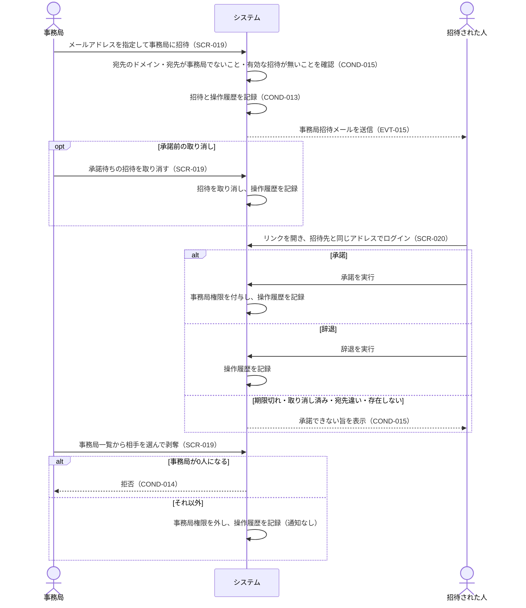

# BIZ-006: ユーザー認証・権限

アカウントを作れるのをosaka-u.ac.jpドメイン（サブドメイン含む）のメールアドレスを持つ阪大関係者に限ることで、利用者を絞り込むコンテキスト。アカウント登録・メール認証・ログインと、事務局権限の付与・剥奪を担う。

ドメインで絞るのは入口だけである。既にアカウントを持つ人はドメインを問わずログインでき、メールアドレスの変更時には変更後のアドレスが再びこの制限を受ける（COND-004）。

ログインの手段はメール認証コードとパスキーの2つで、パスワードは扱わない。パスワードを持たないため、パスワードリセットも不要である（将来のSSO連携を見据えた判断。詳細は`docs/adr/`を参照）。

メールアドレスは本人確認の唯一の手がかりであるため、その変更（BUC-024）には現在のアドレスと新しいアドレスの双方で認証コードによる確認を要する。現在のアドレスを確認しないと、端末を一時的に奪われただけでアカウントごと乗っ取られてしまうためである。

事務局権限（INFO-006.is_staff）の付与・剥奪（BUC-027）もこのコンテキストで扱う。以前は DB を直接書き換えるしかなく、誰がいつ権限を与えたかが残らなかった。画面から操作できるようにし、操作履歴（BIZ-007）に記録する。付与は団体の招待（BUC-011・BUC-023）と同じく招待と承諾で行い、宛先本人だけが承諾できる（COND-015）。最初の1人の事務局だけは、これまでどおり DB またはシードで設定する。以降は COND-014 により0人になることはない。

## ビジネスコンテキスト図

## 業務フロー

### BUC-020: アカウント登録

### BUC-021: ログイン

### BUC-022: パスキーの登録

### BUC-024: メールアドレスの変更

### BUC-027: 事務局権限の付与・剥奪

