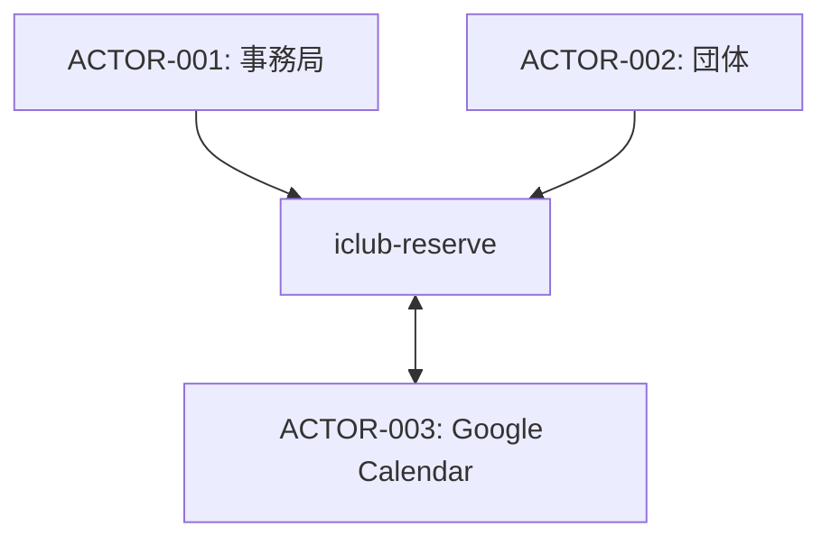
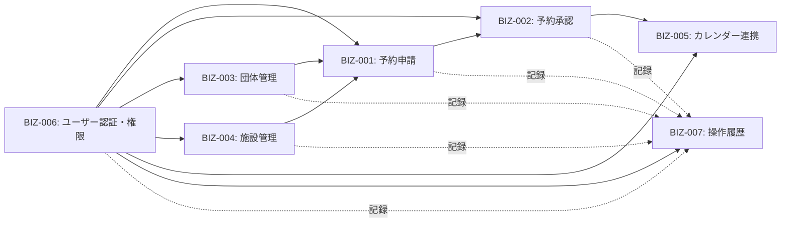

# iclub-reserve 全体概観

Innovators' Club が管理する施設の予約を団体アカウントで管理し、事務局による承認制で運用するシステム。

## システムコンテキスト図

```mermaid
graph TB
    actor1["ACTOR-001: 事務局"]
    actor2["ACTOR-002: 団体"]
    ext1["ACTOR-003: Google Calendar"]
    system["iclub-reserve"]

    actor1 --> system
    actor2 --> system
    system <--> ext1
```

## コンテキスト間関係図

```mermaid
graph LR
    BIZ001["BIZ-001: 予約申請"]
    BIZ002["BIZ-002: 予約承認"]
    BIZ003["BIZ-003: 団体管理"]
    BIZ004["BIZ-004: 施設管理"]
    BIZ005["BIZ-005: カレンダー連携"]
    BIZ006["BIZ-006: ユーザー認証・権限"]
    BIZ007["BIZ-007: 操作履歴"]

    BIZ001 --> BIZ002
    BIZ002 --> BIZ005
    BIZ003 --> BIZ001
    BIZ004 --> BIZ001
    BIZ006 --> BIZ001
    BIZ006 --> BIZ002
    BIZ006 --> BIZ003
    BIZ006 --> BIZ004
    BIZ006 --> BIZ005
    BIZ006 --> BIZ007
    BIZ001 -. 記録 .-> BIZ007
    BIZ002 -. 記録 .-> BIZ007
    BIZ003 -. 記録 .-> BIZ007
    BIZ004 -. 記録 .-> BIZ007
    BIZ006 -. 記録 .-> BIZ007
```

点線は、各コンテキストの操作が操作履歴（INFO-008）に記録されることを表す（COND-013）。
