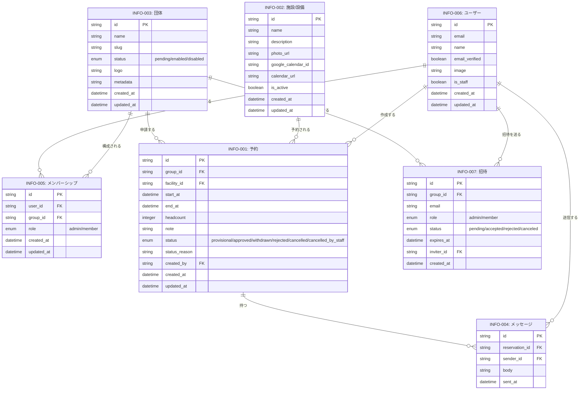

# 情報モデル（横断）

認証基盤（Better Auth）が内部で管理するデータ——セッション・外部アカウント・認証コード・パスキー——は業務上の情報ではないため、本モデルには含めない。一方、招待（INFO-007）は団体運営の業務そのものに現れる情報なので含めている。

## ER図

## 予約の開示範囲（COND-008）

INFO-001 の属性は、見る人によって次の3段階で開示する。

| 属性                  | 自団体・事務局 | 他団体（ログイン済み） | 一般（Google Calendar） |
| --------------------- | :------------: | :--------------------: | :---------------------: |
| facility_id（施設名） |       ○        |           ○            |            ○            |
| start_at / end_at     |       ○        |           ○            |            ○            |
| group_id（団体名）    |       ○        |           ○            |            ×            |
| status                |       ○        |           ○            |            ×            |
| headcount             |       ○        |           ×            |            ×            |
| note                  |       ○        |           ×            |            ×            |
| status_reason         |       ○        |           ×            |            ×            |
| created_by            |       ○        |           ×            |            ×            |
| INFO-004 メッセージ   |       ○        |           ×            |            ×            |

Google Calendar に載せるのは承認済みの予約のみ。他団体のログイン済みユーザーには、仮予約もステータス付きで表示する。
