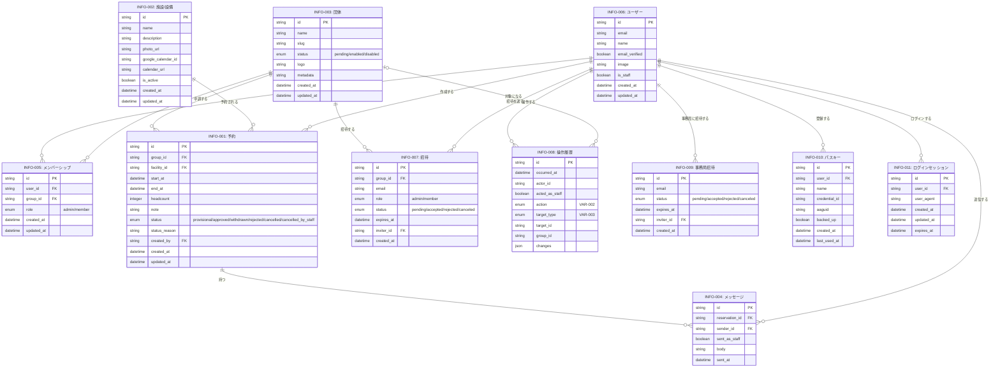

# 情報モデル（横断）

認証基盤（Better Auth）が内部で管理するデータのうち、外部アカウント・認証コードは業務上の情報ではないため、本モデルには含めない。パスキー（INFO-010）とログインセッション（INFO-011）も同じく Better Auth が管理するが、利用者がアカウント設定（SCR-021）で見て操作するため含めている。その場合も、画面に出す・判定に使う属性だけを載せる。招待（INFO-007）は団体運営の業務そのものに現れる情報なので含めている。

各情報の `traces_to` に並ぶ画面（`SCR-*`）は、その情報を `information` に載せている画面（各コンテキストの `boundary.screens`）を逆引きしたものである。両者が食い違ったときは画面側を正とする。画面の `information` には、その画面が表示する・入力を受けるものだけを載せ、ユースケースの結果として裏で作られる・変わるだけの情報は載せない（その関係は、ここの `traces_to` に並ぶユースケース（`UC-*`）で表す）。画面の `information` を変えたら、ここも合わせて直す。

## ER図

INFO-008 の actor_id・group_id・target_id は論理的な参照であり、外部キー制約を張らない。記録の対象や操作者が後から消えても、記録は残す必要があるためである。

## 予約の開示範囲（COND-008）

INFO-001 の属性は、見る人によって次の3段階で開示する。

| 属性                  | 自団体・事務局 | 他団体（ログイン済み） | 一般（Google Calendar） |
| --------------------- | :------------: | :--------------------: | :---------------------: |
| facility_id（施設名） |       ○        |           ○            |            ○            |
| start_at / end_at     |       ○        |           ○            |            ○            |
| group_id（団体名）    |       ○        |           ○            |            ×            |
| status                |       ○        |           ○            |            ×            |
| headcount             |       ○        |           ×            |            ×            |
| note                  |       ○        |           ×            |            ×            |
| status_reason         |       ○        |           ×            |            ×            |
| created_by            |       ○        |           ×            |            ×            |
| INFO-004 メッセージ   |       ○        |           ×            |            ×            |

Google Calendar に載せるのは承認済みの予約のみ。他団体のログイン済みユーザーには、仮予約もステータス付きで表示する。

メッセージの送信者は氏名で表示する。ただし自団体のメンバーには、INFO-004.sent_as_staff が true のメッセージの送信者を「事務局」とだけ表示する（操作履歴の COND-012 と同じ考え方）。

## 操作履歴の開示範囲（COND-012）

INFO-008 は、記録対象の種類（VAR-003）と見る人によって開示する。範囲は COND-008 と SCR-007 の既存の開示範囲にそろえる。

| 記録対象の種類 | 事務局 | 自団体の管理者 | 自団体のメンバー | 他団体 |
| -------------- | :----: | :------------: | :--------------: | :----: |
| 予約           |   ○    |       ○        |        ○         |   ×    |
| 団体           |   ○    |       ○        |        ×         |   ×    |
| メンバーシップ |   ○    |       ○        |        ×         |   ×    |
| 招待           |   ○    |       ○        |        ×         |   ×    |
| 施設/設備      |   ○    |       ×        |        ×         |   ×    |
| 事務局権限     |   ○    |       ×        |        ×         |   ×    |

団体側（管理者・メンバー）には、acted_as_staff が true の記録の操作者を「事務局」とだけ表示する。
