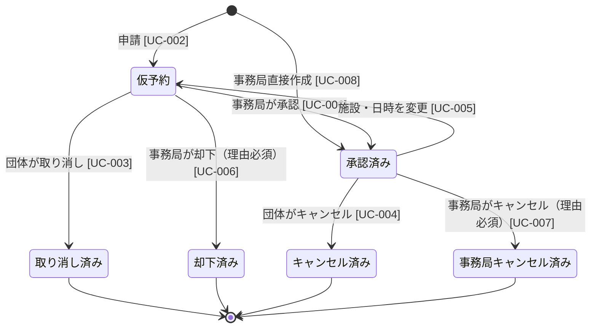

# 状態モデル（横断）

## STATE-001: 予約ステータス

```mermaid
stateDiagram-v2
    [*] --> 仮予約 : 申請 [UC-002]
    [*] --> 承認済み : 事務局直接作成 [UC-008]
    仮予約 --> 承認済み : 事務局が承認 [UC-006]
    仮予約 --> 取り消し済み : 団体が取り消し [UC-003]
    仮予約 --> 却下済み : 事務局が却下（理由必須）[UC-006]
    承認済み --> キャンセル済み : 団体がキャンセル [UC-004]
    承認済み --> 事務局キャンセル済み : 事務局がキャンセル（理由必須）[UC-007]
    承認済み --> 仮予約 : 施設・日時を変更 [UC-005]
    取り消し済み --> [*]
    却下済み --> [*]
    キャンセル済み --> [*]
    事務局キャンセル済み --> [*]
```
