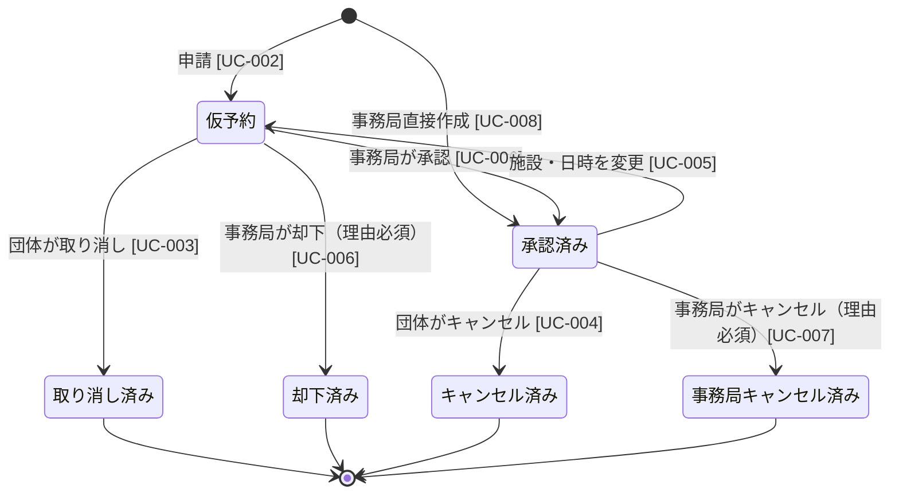
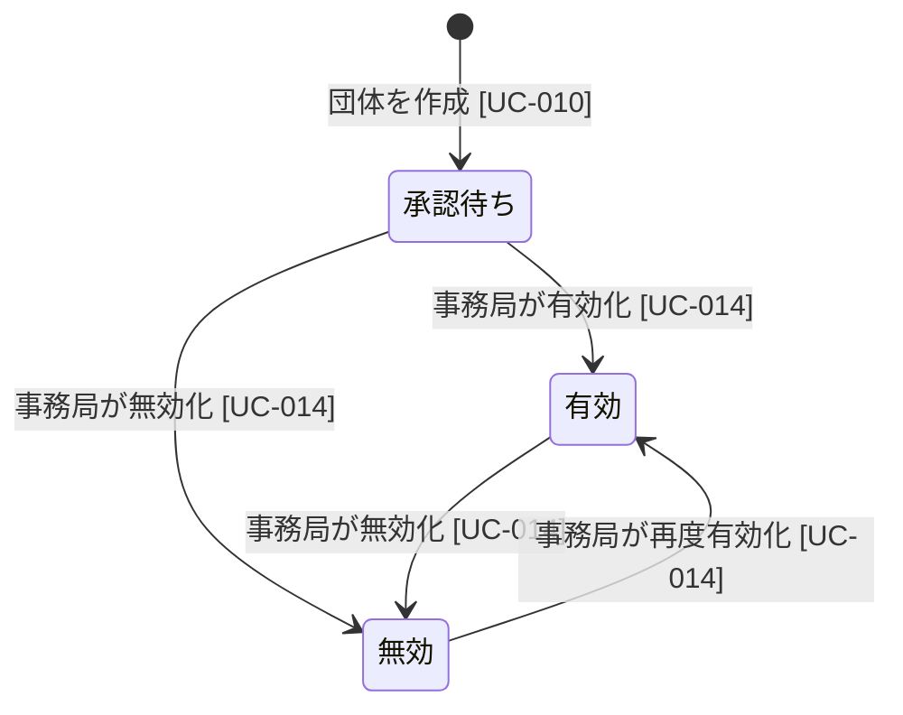

# 状態モデル（横断）

## STATE-001: 予約ステータス

```mermaid
stateDiagram-v2
    [*] --> 仮予約 : 申請 [UC-002]
    [*] --> 承認済み : 事務局直接作成 [UC-008]
    仮予約 --> 承認済み : 事務局が承認 [UC-006]
    仮予約 --> 取り消し済み : 団体が取り消し [UC-003]
    仮予約 --> 却下済み : 事務局が却下（理由必須）[UC-006]
    承認済み --> キャンセル済み : 団体がキャンセル [UC-004]
    承認済み --> 事務局キャンセル済み : 事務局がキャンセル（理由必須）[UC-007]
    承認済み --> 仮予約 : 施設・日時を変更 [UC-005]
    取り消し済み --> [*]
    却下済み --> [*]
    キャンセル済み --> [*]
    事務局キャンセル済み --> [*]
```

## STATE-002: 団体ステータス

```mermaid
stateDiagram-v2
    [*] --> 承認待ち : 団体を作成 [UC-010]
    承認待ち --> 有効 : 事務局が有効化 [UC-014]
    承認待ち --> 無効 : 事務局が無効化 [UC-014]
    有効 --> 無効 : 事務局が無効化 [UC-014]
    無効 --> 有効 : 事務局が再度有効化 [UC-014]
```

予約を申請できるのは「有効」の団体だけである（COND-006）。団体を削除する遷移は用意しない。予約が紐づく団体を消すと、過去に誰がいつ利用したかをたどれなくなるためである（GOAL-001）。
